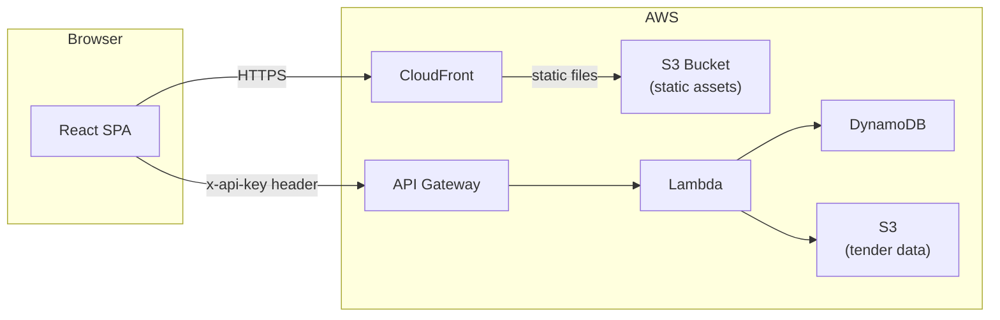
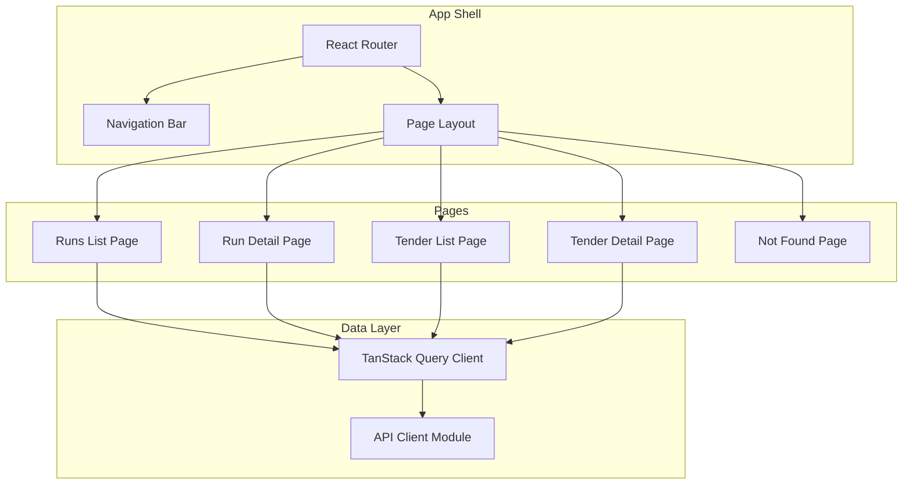
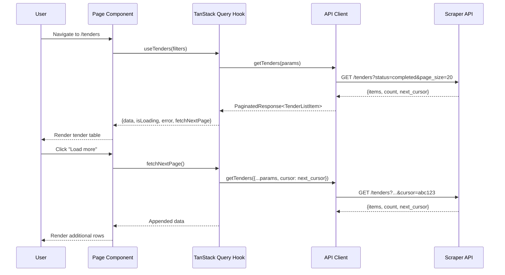

# Design Document: RFP Web App v1

## Overview

The RFP Web App v1 is a read-only, internal single-page application (SPA) for browsing scraper operations and reviewing tender results with AI-generated analysis scores. It is a pure presentation layer — all data comes from the existing RFP Scraper REST API. There is no backend to build.

The app serves two primary use cases:
1. **Scraper Operations** — Monitor scrape runs, view collection/retrieval statistics, and debug issues.
2. **Tender Results Browser** — Browse collected tenders, review analysis scores and summaries, filter/sort by relevance, and download tender documents.

### Tech Stack

| Layer | Choice | Rationale |
|-------|--------|-----------|
| Framework | React 18+ | Component model, ecosystem, team familiarity |
| Build tool | Vite | Fast HMR, native ESM, simple config |
| Language | TypeScript (strict) | Type safety for API response shapes |
| Styling | Tailwind CSS | Utility-first, no custom CSS files needed |
| Components | shadcn/ui | Accessible, composable, no runtime dependency |
| Data fetching | TanStack Query v5 | Cursor pagination, caching, loading/error states |
| Routing | React Router v6 | Client-side routing, nested layouts |
| Hosting | S3 + CloudFront | Static SPA, near-zero cost, HTTPS |
| Auth (v1) | API key via `VITE_API_KEY` env var | Embedded at build time, sent as `x-api-key` header |

### Key Design Decisions

- **No SSR**: This is an internal tool for <5 users. A static SPA is simpler and cheaper than server-rendered alternatives.
- **API key in client JS**: Acceptable for an internal tool. The API Gateway has rate limiting as a safety net. Cognito can be added later.
- **Cursor-based pagination with "Load more"**: The API uses opaque cursor tokens. TanStack Query's `useInfiniteQuery` handles this naturally. No page number navigation.
- **Client-side sorting for non-supported fields**: The API only supports server-side sort by `relevance_score` and default `discovered_at`. Budget and deadline sorting happen client-side on loaded data.
- **Runs built first, then tenders**: Per the build priority decision, scraper operations visibility comes first.

## Architecture

### High-Level Architecture



The SPA is served from S3 via CloudFront. All data requests go directly from the browser to the Scraper API (API Gateway + Lambda). There is no BFF (backend-for-frontend) layer.

### Application Architecture



### Routing Structure

| Route | Page | Description |
|-------|------|-------------|
| `/` | — | Redirects to `/tenders` |
| `/tenders` | Tender List | Default landing page, filterable/sortable tender table |
| `/tenders/:sourceId/:tenderId` | Tender Detail | Full tender metadata, analysis, documents |
| `/runs` | Runs List | All scrape runs across sources |
| `/runs/:sourceId/:runDate` | Run Detail | Single run stats + linked tenders |
| `*` | Not Found | 404 page with link back to `/tenders` |

## Components and Interfaces

### API Client Module (`src/api/client.ts`)

A single `apiFetch<T>` function that handles authentication, query parameters, and error parsing. All API calls go through this function.

```typescript
const API_BASE = import.meta.env.VITE_API_BASE_URL;
const API_KEY = import.meta.env.VITE_API_KEY;

async function apiFetch<T>(
  path: string,
  params?: Record<string, string | undefined>
): Promise<T>;
```

Behavior:
- Attaches `x-api-key` header to every request
- Strips `undefined`/`null` params before building the URL
- On non-2xx: parses JSON body for `detail`, throws `ApiError`
- On JSON parse failure: throws with HTTP status text

### API Endpoint Functions (`src/api/endpoints.ts`)

Typed wrapper functions for each API endpoint:

```typescript
// Tenders
function getTenders(params?: TenderListParams): Promise<PaginatedResponse<TenderListItem>>;
function getTenderDetail(sourceId: string, tenderId: string): Promise<TenderDetailResponse>;
function getTenderDocuments(sourceId: string, tenderId: string): Promise<PaginatedResponse<DocumentItem>>;

// Sources
function getSources(): Promise<SourceListItem[]>;

// Runs
function getSourceRuns(sourceId: string, params?: PaginationParams): Promise<PaginatedResponse<RunListItem>>;
function getRunDetail(sourceId: string, runDate: string): Promise<RunDetailResponse>;
function getRunTenders(sourceId: string, runDate: string, phase: 'discovered' | 'processed', params?: PaginationParams): Promise<PaginatedResponse<TenderListItem>>;
```

### TanStack Query Hooks (`src/hooks/`)

Custom hooks wrapping TanStack Query for each data-fetching concern:

| Hook | Query Type | Endpoint(s) |
|------|-----------|-------------|
| `useTenders` | `useInfiniteQuery` | `GET /tenders` |
| `useTenderDetail` | `useQuery` | `GET /tenders/{sourceId}/{tenderId}` |
| `useTenderDocuments` | `useQuery` | `GET /tenders/{sourceId}/{tenderId}/documents` |
| `useSources` | `useQuery` | `GET /sources/` |
| `useAllRuns` | `useQueries` | `GET /sources/` → `GET /sources/{id}/runs` per source |
| `useRunDetail` | `useQuery` | `GET /sources/{sourceId}/runs/{runDate}` |
| `useRunTenders` | `useInfiniteQuery` | `GET /sources/{sourceId}/runs/{runDate}/tenders` |

Key patterns:
- `useTenders` and `useRunTenders` use `useInfiniteQuery` with `getNextPageParam` extracting `next_cursor`.
- `useAllRuns` fetches sources first, then fans out to fetch runs per source, merges and sorts by date descending.
- `useTenderDocuments` tracks fetch time to detect presigned URL expiry (re-fetch after 50 minutes).

### Page Components

#### Runs List Page (`src/pages/RunsListPage.tsx`)

- Uses `useAllRuns` to fetch and merge runs from all sources
- Renders a table with run date, source, status, collector stats, retriever stats
- Source filter dropdown (populated from `useSources`)
- Rows are clickable, navigating to `/runs/:sourceId/:runDate`
- Loading skeleton while fetching
- Error alert on API failure

#### Run Detail Page (`src/pages/RunDetailPage.tsx`)

- Uses `useRunDetail` for run stats
- Uses `useRunTenders` (×2) for discovered and processed tender lists
- Displays collector and retriever result maps as stat cards
- Two sections for discovered/processed tenders with "Load more" buttons
- Tender rows link to `/tenders/:sourceId/:tenderId`
- 404 handling when run not found

#### Tender List Page (`src/pages/TenderListPage.tsx`)

- Uses `useTenders` with `useInfiniteQuery` for cursor-based pagination
- Filter bar: status dropdown, source dropdown, date range pickers, analyzed toggle
- Sort controls: discovered date (default, server-side), relevance score (server-side), budget/deadline (client-side)
- Table columns: title, organization, status, relevance score (color-coded badge), budget, deadline, location, source, discovered date
- Score badge colors: green (7-10), yellow (4-6), red (1-3), gray (null), gray "Filtered" (0)
- Budget displays "Not specified" when value is 0
- "Load more" button at bottom when `next_cursor` is present
- Rows link to `/tenders/:sourceId/:tenderId`

#### Tender Detail Page (`src/pages/TenderDetailPage.tsx`)

- Uses `useTenderDetail` for tender data
- Uses `useTenderDocuments` for document list
- Sections:
  1. **Metadata**: title, organization, budget, deadline, location, sectors, types, posted date, status, status name
  2. **Scraper Status**: status, retry count, last attempt, last error, documents downloaded/failed, skip reason
  3. **Analysis** (if analyzed): summary, context, relevance score, tags, tender type, model, analyzed at
  4. **Requirements** (if present): experts, references, turnover breakdowns
  5. **Description**: plain text description in a readable block
  6. **Documents**: filename, size, download link (presigned URL)
  7. **Warnings**: alert banner if any warnings present
  8. **Run Links**: links to discovery run and processing run detail pages
- Presigned URL refresh: tracks document fetch timestamp, re-fetches after 50 minutes before download
- 404 handling when tender not found

### Shared UI Components

| Component | Purpose |
|-----------|---------|
| `LoadingSpinner` | Displayed while data is loading |
| `ErrorAlert` | Displays API error messages with retry button |
| `ScoreBadge` | Color-coded relevance score display |
| `StatusBadge` | Tender/run status with appropriate color |
| `LoadMoreButton` | "Load more" button for cursor pagination |
| `FilterBar` | Reusable filter controls (dropdowns, date pickers) |
| `StatCard` | Key-value stat display for run detail stats |
| `DataTable` | Wrapper around shadcn/ui Table with sortable headers |

## Data Models

### TypeScript Interfaces

```typescript
// === Pagination ===
interface PaginatedResponse<T> {
  items: T[];
  count: number;
  next_cursor: string | null;
}

interface ErrorResponse {
  detail: string;
  status_code: number;
}

// === Tenders ===
interface TenderListItem {
  source_id: string;
  tender_id: string;
  title: string;
  posted_date: string;
  deadline: string | null;
  discovered_at: string;
  status: string;
  fully_visible: boolean;
  budget: number;
  status_name: string | null;
  location_names: string | null;
  sectors: string | null;
  types: string | null;
  documents_total: number;
  relevance_score: number | null;
  analysis_summary: string | null;
  analysis_tags: string[];
  tender_type: string | null;
  analyzed_at: string | null;
  organization: string | null;
}

interface TenderDetailResponse extends TenderListItem {
  pk: string;
  retry_count: number;
  last_attempt: string | null;
  last_error: string | null;
  s3_prefix: string | null;
  documents_downloaded: number;
  documents_failed: number;
  skip_reason: string | null;
  discovered_run_id: string | null;
  processed_run_id: string | null;
  detail: Record<string, unknown> | null;
  description_text: string | null;
  warnings: string[];
  analysis_context: string | null;
  analysis_model: string | null;
  emailed_at: string | null;
  experts_required: ExpertsRequired | null;
  references_required: ReferencesRequired | null;
  turnover_required: TurnoverRequired | null;
}

interface ExpertsRequired {
  international: number;
  local: number;
  key_experts: number;
  total: number;
  notes: string | null;
}

interface ReferencesRequired {
  count: number;
  type: string;
  value_eur: number;
  timeline_years: number;
  notes: string | null;
}

interface TurnoverRequired {
  annual_eur: number;
  years: number;
  notes: string | null;
}

// === Documents ===
interface DocumentItem {
  filename: string;
  url: string;
  size_bytes: number | null;
}

// === Sources ===
interface SourceListItem {
  source_id: string;
  enabled: boolean;
  base_url: string;
}

// === Runs ===
interface RunListItem {
  pk: string;
  source_id: string;
  run_date: string;
  started_at: string;
  completed_at: string | null;
  status: string;
}

interface CollectorResult {
  total_found: number;
  new_tenders: number;
  new_pending: number;
  new_skipped: number;
  duplicates: number;
  errors: number;
}

interface RetrieverResult {
  processed: number;
  successful: number;
  failed: number;
  permanently_failed: number;
  documents_downloaded: number;
  documents_failed: number;
}

interface RunDetailResponse extends RunListItem {
  collector_result: CollectorResult | null;
  retriever_result: RetrieverResult | null;
}

// === Query Params ===
interface TenderListParams {
  source_id?: string;
  discovered_from?: string;
  discovered_to?: string;
  status?: string;
  fully_visible?: string;
  analyzed?: string;
  min_score?: string;
  tender_type?: string;
  sort_by?: string;
  page_size?: string;
  cursor?: string;
}

interface PaginationParams {
  page_size?: string;
  cursor?: string;
}
```

### Data Flow



### State Management

The app uses TanStack Query as the sole state management solution. There is no global state store (no Redux, Zustand, etc.).

- **Server state**: Managed entirely by TanStack Query (caching, refetching, pagination).
- **UI state**: Local component state (`useState`) for filter selections, sort direction, and UI toggles.
- **URL state**: Filter and sort parameters are reflected in URL search params via React Router, enabling deep-linkable filtered views.

### Presigned URL Expiry Handling

Documents use presigned S3 URLs that expire after 1 hour. The `useTenderDocuments` hook stores the fetch timestamp. When a download is initiated and the timestamp is older than 50 minutes, the hook automatically re-fetches the document list to get fresh URLs before opening the download link.


## Correctness Properties

*A property is a characteristic or behavior that should hold true across all valid executions of a system — essentially, a formal statement about what the system should do. Properties serve as the bridge between human-readable specifications and machine-verifiable correctness guarantees.*

### Property 1: API key header on every request

*For any* API request path and any set of query parameters, the `apiFetch` function should always include the `x-api-key` header with the configured API key value in the outgoing HTTP request.

**Validates: Requirements 2.1**

### Property 2: API client error propagation

*For any* non-2xx HTTP status code and any response body, the `apiFetch` function should throw an error that contains the `detail` field from the JSON body when the body is valid JSON, or the HTTP status text when the body cannot be parsed as JSON.

**Validates: Requirements 2.4, 2.5**

### Property 3: Query parameter serialization

*For any* record of string key-value pairs passed as query parameters to `apiFetch`, the resulting request URL should contain all provided key-value pairs as URL search parameters, and should omit any keys whose values are `undefined` or `null`.

**Validates: Requirements 2.6**

### Property 4: Undefined routes show 404 page

*For any* URL path that does not match one of the defined routes (`/`, `/tenders`, `/tenders/:sourceId/:tenderId`, `/runs`, `/runs/:sourceId/:runDate`), the router should render the "Page not found" component.

**Validates: Requirements 3.4**

### Property 5: Runs sorted by date descending after merge

*For any* collection of run items from multiple sources, after merging and sorting, the resulting array should be ordered by `started_at` descending (each element's `started_at` should be greater than or equal to the next element's `started_at`).

**Validates: Requirements 4.3**

### Property 6: Source filter on runs list

*For any* source filter selection and any collection of run items, the filtered result should contain only runs whose `source_id` matches the selected source. When "all sources" is selected, all runs should be included.

**Validates: Requirements 4.4**

### Property 7: Tender list filter correctness

*For any* combination of filter parameters (status, source_id, discovered_from, discovered_to, analyzed), the query parameters sent to the API should exactly reflect the active filter selections, and when filtering client-side, all displayed tenders should satisfy every active filter predicate simultaneously.

**Validates: Requirements 6.3, 6.4, 6.5, 6.6**

### Property 8: Client-side sort correctness

*For any* list of tender items and any client-side sort field (budget or deadline), the sorted result should be ordered according to that field's natural ordering (numeric descending for budget, date ascending for deadline), with null values sorted last.

**Validates: Requirements 6.8**

### Property 9: Score badge color mapping

*For any* relevance score value (integer 0-10 or null), the `ScoreBadge` component should return the correct color: green for 7-10, yellow for 4-6, red for 1-3, gray with "Filtered" label for 0, and gray with "N/A" label for null.

**Validates: Requirements 6.9, 6.15**

### Property 10: Budget formatting

*For any* budget value (non-negative integer), the budget formatter should return "Not specified" when the value is 0, and a EUR-formatted string (e.g. "€500,000") for any positive value.

**Validates: Requirements 6.10, 7.3**

### Property 11: Presigned URL expiry detection

*For any* document fetch timestamp and any current timestamp, the expiry check function should return `true` (indicating re-fetch needed) when the elapsed time exceeds 50 minutes, and `false` otherwise.

**Validates: Requirements 7.10**

### Property 12: All warnings rendered

*For any* tender with a non-empty `warnings` array, the rendered output should contain every warning string from the array.

**Validates: Requirements 7.12**

### Property 13: Run ID to URL link generation

*For any* run ID string in the format `{source_id}#{run_date}`, the link generator should produce the URL `/runs/{source_id}/{run_date}`. For null or undefined run IDs, no link should be generated.

**Validates: Requirements 7.16**

## Error Handling

### API Client Error Strategy

The API client (`apiFetch`) is the single point of error handling for all HTTP communication:

| Condition | Behavior |
|-----------|----------|
| HTTP 400 | Throw `ApiError` with detail message (bad query params, malformed cursor) |
| HTTP 403 | Throw `ApiError` — UI shows "API key is invalid or missing" |
| HTTP 404 | Throw `ApiError` — page-level handling shows "not found" message |
| HTTP 500 | Throw `ApiError` — UI shows "Server error, please retry" |
| Network failure | Throw `Error` — UI shows "API is unreachable" |
| Non-JSON response | Throw `Error` with HTTP status text |

### Custom Error Class

```typescript
class ApiError extends Error {
  constructor(
    public detail: string,
    public statusCode: number
  ) {
    super(detail);
  }
}
```

### Page-Level Error Handling

Each page uses TanStack Query's `isError` and `error` states to render the `ErrorAlert` component. The error alert includes:
- A human-readable message based on the error type (403, 500, network, etc.)
- A "Retry" button that calls TanStack Query's `refetch()` — no navigation needed
- The raw error detail for debugging

### 404 Handling

- **Tender Detail**: If `GET /tenders/{sourceId}/{tenderId}` returns 404, show "Tender not found" with a link back to the tender list.
- **Run Detail**: If `GET /sources/{sourceId}/runs/{runDate}` returns 404, show "Run not found" with a link back to the runs list.
- **Unknown routes**: React Router catch-all renders a "Page not found" component.

### Presigned URL Expiry

Document presigned URLs expire after 1 hour. The `useTenderDocuments` hook tracks when documents were last fetched. Before initiating a download, if more than 50 minutes have elapsed, the hook triggers a re-fetch to get fresh URLs. This is transparent to the user.

### Loading States

Every page that fetches data shows a loading indicator (spinner or skeleton) while `isLoading` is true. TanStack Query handles the loading state automatically. Subsequent fetches (e.g., "Load more") show a smaller inline loading indicator on the button rather than replacing the entire page.

## Testing Strategy

### Dual Testing Approach

The app uses both unit tests and property-based tests for comprehensive coverage:

- **Unit tests** (Vitest): Specific examples, edge cases, error conditions, component rendering
- **Property-based tests** (fast-check via Vitest): Universal properties across generated inputs

### Property-Based Testing Configuration

- **Library**: [fast-check](https://github.com/dubzzz/fast-check) integrated with Vitest
- **Minimum iterations**: 100 per property test
- **Tagging**: Each property test includes a comment referencing the design property:
  ```typescript
  // Feature: rfp-web-v1, Property 1: API key header on every request
  ```
- **Each correctness property is implemented by a single property-based test**

### Test Organization

```
src/
├── api/
│   ├── client.test.ts          # Properties 1, 2, 3 (API client behavior)
│   └── endpoints.test.ts       # Unit tests for endpoint wrappers
├── utils/
│   ├── formatting.test.ts      # Properties 9, 10 (score badge, budget formatting)
│   ├── sorting.test.ts         # Properties 5, 8 (run sort, client-side tender sort)
│   ├── filtering.test.ts       # Properties 6, 7 (source filter, tender filters)
│   ├── links.test.ts           # Property 13 (run ID to URL)
│   └── expiry.test.ts          # Property 11 (presigned URL expiry)
├── pages/
│   ├── TenderListPage.test.tsx  # Unit tests: rendering, filter UI, load more
│   ├── TenderDetailPage.test.tsx # Unit tests: rendering sections, 404, warnings (Property 12)
│   ├── RunsListPage.test.tsx    # Unit tests: rendering, source filter
│   ├── RunDetailPage.test.tsx   # Unit tests: rendering, 404, pagination
│   └── NotFoundPage.test.tsx    # Property 4 (undefined routes)
└── components/
    └── *.test.tsx               # Unit tests for shared components
```

### Unit Test Focus Areas

- **Component rendering**: Verify pages render correct sections given mock data
- **Error states**: 403, 404, 500, network errors display correct messages
- **Loading states**: Spinner/skeleton shown while fetching
- **Navigation**: Clicking rows navigates to correct detail pages
- **Conditional rendering**: Analysis section hidden when not analyzed, experts/references/turnover shown only when present
- **Edge cases**: Null fields display dashes, budget=0 shows "Not specified", score=0 shows "Filtered"

### Property Test Focus Areas

Each of the 13 correctness properties maps to a single `fast-check` property test:

| Property | Test File | Generator Strategy |
|----------|-----------|-------------------|
| 1: API key header | `client.test.ts` | Random paths and param records |
| 2: Error propagation | `client.test.ts` | Random non-2xx status codes × random JSON/non-JSON bodies |
| 3: Query param serialization | `client.test.ts` | Random string records with some undefined values |
| 4: Undefined routes → 404 | `NotFoundPage.test.tsx` | Random path strings not matching defined routes |
| 5: Runs sort order | `sorting.test.ts` | Random arrays of RunListItem with random dates |
| 6: Source filter on runs | `filtering.test.ts` | Random arrays of RunListItem × random source selection |
| 7: Tender filter correctness | `filtering.test.ts` | Random TenderListItem arrays × random filter combos |
| 8: Client-side sort | `sorting.test.ts` | Random TenderListItem arrays × sort field selection |
| 9: Score badge color | `formatting.test.ts` | Random integers 0-10 and null |
| 10: Budget formatting | `formatting.test.ts` | Random non-negative integers |
| 11: Presigned URL expiry | `expiry.test.ts` | Random timestamp pairs |
| 12: Warnings rendered | `TenderDetailPage.test.tsx` | Random arrays of warning strings |
| 13: Run ID to URL | `links.test.ts` | Random `{source_id}#{run_date}` strings and null |

### Testing Tools

| Tool | Purpose |
|------|---------|
| Vitest | Test runner, assertions, mocking |
| fast-check | Property-based test generation |
| @testing-library/react | Component rendering and queries |
| msw (Mock Service Worker) | API mocking for integration tests |
