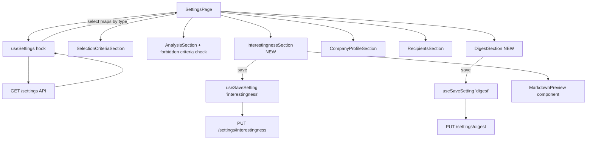
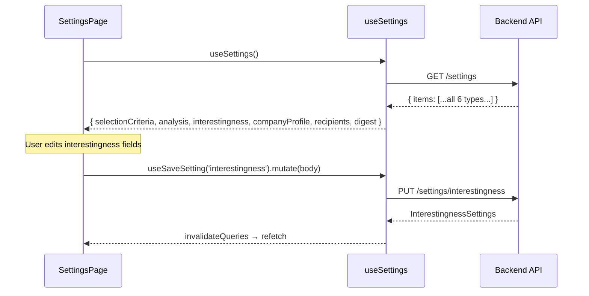

# Design Document: Settings Interestingness & Digest Sections

## Overview

Add two new settings sections (Interestingness and Digest) to SettingsPage.tsx, following the exact existing Section/Card pattern. Also add forbidden criteria validation to the existing Analysis section, and wire up new types + hook integration.

The feature is purely frontend — the backend already exposes `PUT /settings/interestingness` and `PUT /settings/digest`. We're filling the gap in the UI.

### Key Decisions

1. **Markdown preview**: Use the lightweight `marked` library (~7KB gzipped) for rendering. It's mature, dependency-free, and handles standard markdown well. The alternative (hand-rolling a parser) would be fragile and under-featured. Another option (`react-markdown` + `remark`) is much heavier and overkill for a simple preview toggle.
2. **No new component files for sections**: InterestingnessSection and DigestSection are inline in SettingsPage.tsx, matching existing pattern.
3. **One new utility component**: A small `MarkdownPreview` component in `src/components/MarkdownPreview.tsx` to encapsulate the `marked` call and sanitization concerns.
4. **Validation approach**: Same pattern as existing — local `errors` state, validate on save, field-level error display via `Field` component.

## Architecture



### Section Rendering Order

```
Selection Criteria → Analysis → Interestingness → Company Profile → Recipients → Digest
```

## Components and Interfaces

### New Types (`src/api/types.ts`)

```typescript
export interface InterestingnessSettings {
  setting_type: 'interestingness'
  updated_at: string
  interest_profile: string          // max 5000 chars
  scoring_criteria: string[]
  interestingness_top_n: number     // 1–1000, integer
  interestingness_min_score: number // 1–10, integer
}

export interface DigestSettings {
  setting_type: 'digest'
  updated_at: string
  score_threshold_top: number       // 0–10, step 0.1
  score_threshold_floor: number     // 0–10, step 0.1
  max_worth_a_look: number          // 1–1000, integer
  max_excluded_shown: number        // 1–1000, integer
}
```

`SettingType` union extends to: `'selection-criteria' | 'analysis' | 'company-profile' | 'recipients' | 'interestingness' | 'digest'`

`SettingResponse` union extends to include `InterestingnessSettings | DigestSettings`.

### useSettings Hook Extension

The `select` function adds two new properties:

```typescript
return {
  // existing...
  interestingness: map.get('interestingness') as InterestingnessSettings | undefined,
  digest: map.get('digest') as DigestSettings | undefined,
}
```

### InterestingnessSection Component

Props: `{ data: InterestingnessSettings }`

Local state:
- `interestProfile: string` — textarea content
- `topN: number` — interestingness_top_n
- `minScore: number` — interestingness_min_score
- `showPreview: boolean` — toggle between edit/preview
- `errors: Record<string, string>` — validation errors

Validation rules (on save):
- `interest_profile`: non-empty after trim, ≤ 5000 chars
- `interestingness_top_n`: integer, 1–1000
- `interestingness_min_score`: integer, 1–10

Character counter: displays `{length}/5000` below textarea, changes color at limit.

Markdown preview toggle: two-button segmented control (Edit | Preview). Preview mode renders via `MarkdownPreview` component. Edit mode shows the textarea.

### DigestSection Component

Props: `{ data: DigestSettings }`

Local state:
- `thresholdTop: number`
- `thresholdFloor: number`
- `maxWorthALook: number`
- `maxExcluded: number`
- `errors: Record<string, string>`

Validation rules (on save):
- `score_threshold_top`: 0–10 (allows decimals to 1 place)
- `score_threshold_floor`: 0–10 (allows decimals to 1 place)
- `score_threshold_top > score_threshold_floor` (cross-field)
- `max_worth_a_look`: integer, 1–1000
- `max_excluded_shown`: integer, 1–1000

### MarkdownPreview Component

```typescript
// src/components/MarkdownPreview.tsx
interface MarkdownPreviewProps {
  content: string
  className?: string
}
```

Uses `marked` to parse markdown string into HTML, renders via `dangerouslySetInnerHTML`. Since content is user-authored (not from untrusted third parties) and only rendered locally, XSS risk is minimal. We'll use `marked`'s built-in sanitization options.

### Forbidden Criteria Validation (AnalysisSection)

Add to `handleSave()`:
```typescript
const FORBIDDEN_CRITERIA = ['sector fit', 'geographic fit', 'expertise match']
const forbidden = criteria.filter(c =>
  FORBIDDEN_CRITERIA.includes(c.trim().toLowerCase())
)
if (forbidden.length > 0) {
  errs.criteria = `Forbidden criteria: ${forbidden.join(', ')}. These are handled by the interestingness scorer.`
}
```

## Data Models

### API Request Bodies

**PUT /settings/interestingness**:
```json
{
  "interest_profile": "string",
  "scoring_criteria": ["string"],
  "interestingness_top_n": 100,
  "interestingness_min_score": 5
}
```

**PUT /settings/digest**:
```json
{
  "score_threshold_top": 7.5,
  "score_threshold_floor": 4.0,
  "max_worth_a_look": 50,
  "max_excluded_shown": 20
}
```

### API Response Bodies

Same as request but with `setting_type` and `updated_at` added by backend.

### State Flow



## Correctness Properties

*A property is a characteristic or behavior that should hold true across all valid executions of a system — essentially, a formal statement about what the system should do. Properties serve as the bridge between human-readable specifications and machine-verifiable correctness guarantees.*

### Property 1: Character limit enforcement

*For any* string longer than 5000 characters entered into the interest_profile textarea, the system SHALL prevent the excess characters from being accepted and the character counter SHALL display 5000/5000.

**Validates: Requirements 2.2, 4.3**

### Property 2: Whitespace-only interest profile rejection

*For any* interest_profile string composed entirely of whitespace characters (spaces, tabs, newlines), the save validation SHALL reject it with a field-level error and prevent API submission.

**Validates: Requirements 4.2**

### Property 3: Interestingness numeric range enforcement

*For any* value of interestingness_top_n outside the range [1, 1000] or any non-integer value, and *for any* value of interestingness_min_score outside the range [1, 10] or any non-integer value, the save validation SHALL reject it with a field-level error and prevent API submission.

**Validates: Requirements 3.1, 3.2, 3.3, 4.4, 4.5**

### Property 4: Digest cross-field validation

*For any* pair of values (score_threshold_top, score_threshold_floor) where score_threshold_top ≤ score_threshold_floor, the digest save validation SHALL reject with a field-level error on score_threshold_top and prevent API submission.

**Validates: Requirements 5.4, 6.5, 7.3**

### Property 5: Digest numeric range enforcement

*For any* score_threshold_top or score_threshold_floor value outside [0, 10], or any max_worth_a_look or max_excluded_shown value outside [1, 1000] or non-integer, the digest save validation SHALL reject with field-level errors and prevent API submission.

**Validates: Requirements 5.5, 6.6, 7.2, 7.4, 7.5**

### Property 6: Forbidden criteria detection

*For any* scoring_criteria list containing entries whose trimmed, case-insensitive value matches "sector fit", "geographic fit", or "expertise match", the analysis save validation SHALL reject with a field-level error identifying only the forbidden entries by name and prevent API submission. Valid entries in the same list SHALL remain unchanged.

**Validates: Requirements 8.1, 8.2, 8.3, 8.4**

### Property 7: Markdown preview round-trip

*For any* interest_profile content string, toggling from edit to preview and back to edit SHALL preserve the raw text content identically (no character loss or transformation).

**Validates: Requirements 2.3, 2.4**

## Error Handling

| Scenario | Handling |
|----------|----------|
| Validation failure (any section) | Field-level error messages via `errors` state, save prevented |
| PUT request network error | Error message displayed below form via Section's `error` prop |
| PUT request 4xx/5xx | Error message from response body (or generic fallback) displayed |
| Settings API returns no interestingness/digest item | Section omitted from layout (conditional rendering) |
| Markdown rendering error | Catch in MarkdownPreview, show raw text as fallback |

Error display follows existing pattern: `{error && <p className="text-sm text-destructive">{getErrorMessage(error)}</p>}` inside Section wrapper.

## Testing Strategy

### Approach

Per project requirements, no unit test suite for this feature. Verification is via:

1. **Playwright smoke tests** — navigate to settings, verify sections render, fill fields, save, confirm round-trip works against local backend
2. **Manual verification** — cross-field validation (digest thresholds), forbidden criteria rejection, character counter behavior, markdown preview toggle

### Property-Based Testing

The validation logic (range checking, forbidden criteria matching, cross-field comparison) is suitable for property-based testing with `fast-check`. Each correctness property maps to a single PBT:

- **Library**: `fast-check` (already installed as devDependency)
- **Minimum iterations**: 100 per property
- **Tag format**: `Feature: settings-interestingness-digest, Property {N}: {title}`

Tests validate pure validation functions extracted from the section components. The validation logic itself is pure (input → errors object), making it ideal for PBT even though the UI integration is verified via Playwright.

### Test Structure

```
src/pages/__tests__/settings-validation.test.ts
```

Property tests for:
1. Character limit — generate strings of varying length, verify limit enforcement
2. Whitespace rejection — generate whitespace-only strings, verify rejection
3. Interestingness numeric range — generate numbers inside/outside [1,1000] and [1,10], verify accept/reject
4. Digest cross-field — generate threshold pairs, verify top > floor enforcement
5. Digest numeric range — generate values outside [0,10] and [1,1000], verify rejection
6. Forbidden criteria — generate criteria lists with case/whitespace variations of forbidden values, verify detection
7. Preview round-trip — generate arbitrary strings, verify content preserved across toggle
