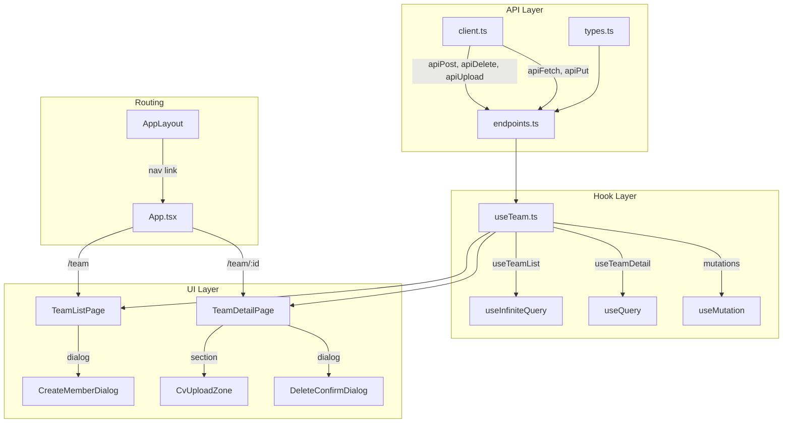
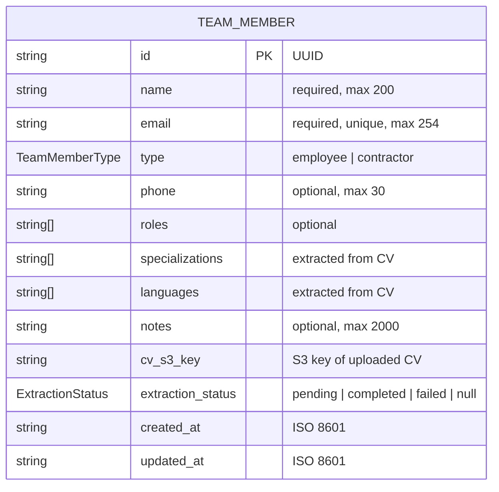
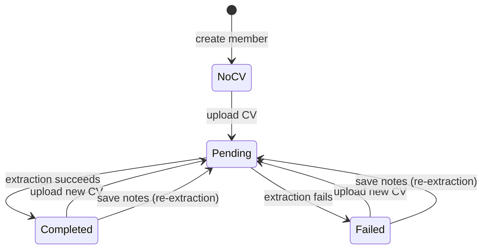

# Design Document: Team Management

## Overview

Team Management adds a full CRUD UI for managing Green Partners' team roster (employees and contractors) within the GPTenders web app. The feature introduces two new pages (`/team` list and `/team/:id` detail), extends the API client with POST/DELETE/multipart helpers, and surfaces backend LLM extraction status after CV uploads.

The design follows established patterns in the codebase: TanStack Query hooks for data fetching, shadcn/ui components for UI primitives, and the existing list/detail page structure used by tenders and runs.

### Key Design Decisions

| Decision | Choice | Rationale |
|----------|--------|-----------|
| Page structure | List + Detail (2 pages) | Matches tender list/detail pattern |
| Create flow | Dialog from list page | Only 4 fields needed; keeps user in list context |
| Detail editing | Always-editable inline fields | Matches Settings page pattern; avoids view/edit toggle |
| Pagination | Page-based `useInfiniteQuery` | API returns `page`/`total_pages`, not cursors |
| CV upload location | Detail page only | Backend requires member ID; keeps create flow lightweight |
| Save granularity | Single save button for whole form | One PUT to one resource |
| Re-extraction warning | Inline info banner | Non-blocking; user doesn't need to confirm |

## Architecture



### Data Flow

1. **List page**: `useTeamList(type, search)` → `getTeamMembers(params)` → `apiFetch('/team', params)` → renders paginated list
2. **Create**: Dialog collects 4 fields → `useCreateMember` → `apiPost('/team', body)` → invalidates list → navigates to `/team/:id`
3. **Detail page**: `useTeamDetail(id)` → `getTeamMember(id)` → `apiFetch('/team/:id')` → populates form
4. **Update**: Form edit → Save button → `useUpdateMember` → `apiPut('/team/:id', body)` → invalidates detail + list
5. **CV upload**: File select → `useUploadCv` → `apiUpload('/team/:id/cv', formData)` → invalidates detail (shows new extraction_status)
6. **Delete**: Confirm dialog → `useDeleteMember` → `apiDelete('/team/:id')` → invalidates list → navigates to `/team`

## Components and Interfaces

### API Client Extensions (`src/api/client.ts`)

```typescript
export async function apiPost<T>(path: string, body: unknown): Promise<T>
export async function apiDelete(path: string): Promise<void>
export async function apiUpload<T>(path: string, body: FormData): Promise<T>
```

All three follow the same error-handling pattern as `apiFetch`/`apiPut`: parse JSON error body → throw `ApiError`. `apiUpload` omits `Content-Type` header to let the browser set the multipart boundary.

### Type Definitions (`src/api/types.ts`)

```typescript
export type TeamMemberType = 'employee' | 'contractor'
export type ExtractionStatus = 'pending' | 'completed' | 'failed'

export interface TeamMemberListItem {
  id: string
  name: string
  email: string
  type: TeamMemberType
  roles: string[]
  extraction_status: ExtractionStatus | null
}

export interface TeamMemberResponse extends TeamMemberListItem {
  phone: string | null
  specializations: string[]
  languages: string[]
  notes: string | null
  cv_s3_key: string | null
  created_at: string
  updated_at: string
}

export interface TeamMemberCreate {
  name: string
  email: string
  type: TeamMemberType
  roles?: string[]
}

export interface TeamMemberUpdate {
  name?: string
  email?: string
  phone?: string
  roles?: string[]
  notes?: string
}

export interface TeamListParams {
  page?: string
  page_size?: string
  type?: TeamMemberType
  q?: string
}
```

### Endpoint Functions (`src/api/endpoints.ts`)

```typescript
export function getTeamMembers(params?: TeamListParams): Promise<PaginatedResponse<TeamMemberListItem>>
export function getTeamMember(id: string): Promise<TeamMemberResponse>
export function createTeamMember(body: TeamMemberCreate): Promise<TeamMemberResponse>
export function updateTeamMember(id: string, body: TeamMemberUpdate): Promise<TeamMemberResponse>
export function deleteTeamMember(id: string): Promise<void>
export function uploadTeamMemberCv(id: string, file: File): Promise<TeamMemberResponse>
```

### Hook Interfaces (`src/hooks/useTeam.ts`)

| Hook | Type | Query Key | Notes |
|------|------|-----------|-------|
| `useTeamList` | `useInfiniteQuery` | `['team-members', { type, search }]` | page-based, `getNextPageParam` returns `page + 1` when `page < total_pages` |
| `useTeamDetail` | `useQuery` | `['team-member', id]` | disabled when `id` is undefined/empty |
| `useCreateMember` | `useMutation` | — | invalidates `['team-members']` on success |
| `useUpdateMember` | `useMutation` | — | invalidates `['team-members']` + `['team-member', id]` |
| `useDeleteMember` | `useMutation` | — | invalidates `['team-members']` |
| `useUploadCv` | `useMutation` | — | invalidates `['team-member', id]` |

### Page Components

**TeamListPage** (`src/pages/TeamListPage.tsx`)
- Search input with 300ms debounce
- Type filter dropdown (All / Employee / Contractor)
- Table rows: name, email, type, roles (tags), extraction_status (badge)
- "Load more" button for pagination
- "Add Member" button → opens CreateMemberDialog
- Click row → navigate to `/team/:id`
- Empty state: contextual message based on active filters
- Error state: ErrorAlert with retry

**TeamDetailPage** (`src/pages/TeamDetailPage.tsx`)
- Editable fields: name, email, phone, roles, notes (with character limits)
- Read-only fields: type, specializations, languages, extraction_status, created_at, updated_at
- CV upload zone (accepts PDF/DOCX, 10MB max)
- Re-extraction warning banner (shown when notes modified + cv_s3_key exists)
- Save button + Delete button
- Loading skeleton while data fetches
- 404 handling with link back to `/team`
- Toast notifications for save success/failure

**CreateMemberDialog** (inline in TeamListPage or extracted component)
- Fields: name, email, type (select), roles (comma-separated)
- Validation: name required, email format, type required
- Submit disabled until valid
- 422 duplicate email → inline error on email field
- Close on backdrop click / escape

**DeleteConfirmDialog** (inline in TeamDetailPage)
- Shows member name, warns deletion is irreversible
- Confirm/Cancel buttons
- Confirm disabled during request

## Data Models

### Entity Relationship



### State Transitions



### API Request/Response Shapes

**POST /team** (create)
- Request: `TeamMemberCreate` (JSON)
- Response: `TeamMemberResponse` (201)
- Error: 422 for duplicate email

**PUT /team/:id** (update)
- Request: `TeamMemberUpdate` (JSON, partial)
- Response: `TeamMemberResponse` (200)
- Error: 409 for duplicate email, 404 for not found

**DELETE /team/:id**
- Response: 204 No Content
- Error: 404 for not found

**POST /team/:id/cv** (upload)
- Request: `multipart/form-data` with file field
- Response: `TeamMemberResponse` (200, includes updated extraction_status)
- Error: 413 for file too large, 415 for unsupported type

**GET /team** (list)
- Params: `page`, `page_size`, `type`, `q`
- Response: `PaginatedResponse<TeamMemberListItem>`

**GET /team/:id** (detail)
- Response: `TeamMemberResponse`
- Error: 404 for not found

## Correctness Properties

*A property is a characteristic or behavior that should hold true across all valid executions of a system — essentially, a formal statement about what the system should do. Properties serve as the bridge between human-readable specifications and machine-verifiable correctness guarantees.*

### Property 1: API client error handling consistency

*For any* non-2xx HTTP status code (400–599) and *for any* response body (valid JSON with a `detail` field, valid JSON without a `detail` field, or non-JSON text), calling `apiPost`, `apiDelete`, or `apiUpload` SHALL throw an `ApiError` where `statusCode` equals the HTTP status and `detail` equals the JSON `detail` field when parseable, or the HTTP status text otherwise.

**Validates: Requirements 1.4**

### Property 2: Pagination termination

*For any* `page` value (positive integer) and `total_pages` value (positive integer or null), the `getNextPageParam` function SHALL return `page + 1` when `total_pages` is not null and `page < total_pages`, and `undefined` in all other cases.

**Validates: Requirements 3.1**

### Property 3: Client-side CV file validation

*For any* file with a given size (in bytes) and MIME type, the validation function SHALL accept the file if and only if size ≤ 10,485,760 bytes AND MIME type is one of `application/pdf` or `application/vnd.openxmlformats-officedocument.wordprocessingml.document`. Files not meeting both criteria SHALL be rejected without initiating an upload request.

**Validates: Requirements 7.4**

### Property 4: Re-extraction warning visibility predicate

*For any* combination of `cv_s3_key` (string or null) and notes field state (current value vs. last-saved value), the re-extraction warning SHALL be visible if and only if `cv_s3_key` is not null AND the current notes value differs from the last-saved notes value.

**Validates: Requirements 10.1, 10.2, 10.3**

### Property 5: Create form validation gate

*For any* combination of name (string), email (string), and type selection state (selected or not), the create dialog submit button SHALL be enabled if and only if name is non-empty (after trimming), email matches a standard email format (`/^[^\s@]+@[^\s@]+\.[^\s@]+$/`), and type has a selected value.

**Validates: Requirements 5.2**

## Error Handling

| Scenario | User-Facing Behavior |
|----------|---------------------|
| List fetch fails | ErrorAlert with retry button |
| Detail fetch returns 404 | "Not found" message + link to `/team` |
| Detail fetch fails (other) | ErrorAlert with retry |
| Create returns 422 (duplicate email) | Inline error below email field |
| Create fails (other) | Error message in dialog, re-enable submit |
| Update returns 409 (duplicate email) | Inline error below email field |
| Update fails (other) | Toast error, re-enable Save |
| Delete fails | Error message in confirmation dialog, re-enable confirm |
| CV upload fails or times out (60s) | Error message on upload zone, restore ready state |
| CV file too large / wrong type | Client-side error message, no request sent |
| Name empty on save | Inline validation error, prevent request |

### Error Propagation Strategy

All API errors flow through `ApiError` class (existing pattern). Components use TanStack Query's `isError`/`error` state. Specific status codes (404, 409, 422) are detected via `error.statusCode` for contextual UI treatment. Generic errors show the `error.detail` message.

## Testing Strategy

### Approach

The team management feature is primarily UI CRUD — forms, list rendering, API integration. Given the brainstorm decision to keep automated tests lean during rapid evolution, the strategy favors:

1. **Property-based tests** for pure logic (API client error handling, validation functions, pagination logic)
2. **Unit tests** for specific edge cases (empty states, 422/409 handling, file validation boundaries)
3. **Playwright smoke tests** (written last) for critical user flows

### Why PBT Applies (Partially)

PBT is appropriate for:
- API client helpers — universal error handling behavior across any status code / response body
- Pagination `getNextPageParam` — behavior varies with page/total_pages values
- File validation — boundary conditions on size and MIME type
- Form validation gate — combinatorial state of name/email/type fields

PBT is NOT appropriate for:
- Page rendering (use Playwright smoke tests)
- Dialog open/close behavior (example-based)
- Navigation flows (Playwright)
- Toast notifications (example-based)

### Property Test Configuration

- Library: `fast-check` (already in devDependencies)
- Minimum iterations: 100 per property
- Tag format: `Feature: team-management, Property {N}: {title}`
- Each correctness property maps to one `fc.assert(fc.property(...))` test

| Property | Test Target | Generator Strategy |
|----------|-------------|-------------------|
| 1: API error handling | `apiPost`, `apiDelete`, `apiUpload` | Random status codes (400–599), random JSON/non-JSON bodies |
| 2: Pagination termination | `getNextPageParam` helper | Random page (1..1000), random total_pages (1..1000 or null) |
| 3: CV file validation | Validation utility function | Random sizes (0..20MB), random MIME strings |
| 4: Re-extraction warning | Visibility predicate function | Random cv_s3_key (null/string), random notes pairs (same/different) |
| 5: Create form validation | Validation predicate function | Random strings for name/email, random type selection |

### Unit Test Targets (Example-Based)

- `apiUpload` does not set Content-Type header (single assertion)
- `apiDelete` returns void without parsing body
- Create dialog: 422 duplicate email renders inline error
- Detail page: 404 renders not-found with link to `/team`
- Extraction status badge: color mapping (pending→yellow, completed→green, failed→red)
- Search debounce: 300ms delay with fake timers
- Mutation hooks: correct query key invalidation on success

### Playwright Smoke Tests

Written at end of implementation:
- List page loads with data
- Create dialog → valid submit → navigates to detail
- Detail page edit → save → toast appears
- CV upload → extraction status badge updates
- Delete → confirm → returns to list
