# Design Document: Tender Detail Overhaul

## Overview

Transform the monolithic `TenderDetailPage.tsx` (~376 lines) into a composable architecture where the page acts as an orchestrator (~150 lines) importing self-contained section components from `src/components/tender-detail/`. Add six new sections: team requirements + match, reference requirements + match, exclusion criteria, unified score breakdown, user feedback, and audit trail. Each data section includes inline action buttons for triggering backend LLM endpoints.

The data layer extends `TenderDetailResponse` with new nullable fields already present on the API, adds typed endpoint functions, and provides TanStack Query hooks for mutations (optimistic feedback, fire-and-forget actions) and lazy-loaded audit data.

## Architecture

```mermaid
graph TD
    TDP[TenderDetailPage<br/>~150 lines orchestrator]
    TDP --> H[HeaderSection]
    TDP --> AI[AiAssessmentSection]
    TDP --> KF[KeyFactsSection]
    TDP --> EX[ExclusionBanner]
    TDP --> FB[FeedbackButtons]
    TDP --> SC[ScoreBreakdownSection]
    TDP --> TR[TeamRequirementsSection]
    TDP --> TM[TeamMatchSection]
    TDP --> RR[ReferenceRequirementsSection]
    TDP --> RM[ReferenceMatchSection]
    TDP --> EC[ExclusionCriteriaSection]
    TDP --> EL[EligibilitySection]
    TDP --> DS[DescriptionSection]
    TDP --> DO[DocumentsSection]
    TDP --> AU[AuditTrailSection]
    TDP --> SI[SystemInfoSection]

    subgraph Hooks
        H1[useTenderDetail]
        H2[useTenderActions]
        H3[useTenderFeedback]
        H4[useTenderAudit]
    end

    TDP --> H1
    TR --> H2
    TM --> H2
    RR --> H2
    RM --> H2
    EC --> H2
    FB --> H3
    AU --> H4
```



**Data flow**: The page fetches tender detail via `useTenderDetail`. Section components receive the tender object (or relevant slice) as props. Action sections additionally use mutation hooks that invalidate the tender detail query on success. The audit section lazily fetches its own data when expanded.

## Components and Interfaces

### Page Orchestrator

`TenderDetailPage.tsx` responsibilities:
- Route param extraction (`sourceId`, `tenderId`)
- Loading/error/404 states
- Conditional rendering logic (exclusion banner, legacy supersession)
- Composing sections in correct order with props

### Section Components (`src/components/tender-detail/`)

| Component | File | Props | Responsibilities |
|-----------|------|-------|-----------------|
| `HeaderSection` | `header-section.tsx` | `tender: TenderDetailResponse` | Title, org, badges, external link |
| `AiAssessmentSection` | `ai-assessment-section.tsx` | `tender: TenderDetailResponse` | Summary, fit analysis, AI badge |
| `KeyFactsSection` | `key-facts-section.tsx` | `tender: TenderDetailResponse` | Budget, deadline, location grid |
| `ExclusionBanner` | `exclusion-banner.tsx` | `exclusionResult: ExclusionResult \| null` | Red banner when excluded |
| `FeedbackButtons` | `feedback-buttons.tsx` | `sourceId, tenderId, feedbackType` | Thumbs up/down toggles |
| `ScoreBreakdownSection` | `score-breakdown-section.tsx` | `tender: TenderDetailResponse` | Factor list with progress bars |
| `TeamRequirementsSection` | `team-requirements-section.tsx` | `tender: TenderDetailResponse, sourceId, tenderId` | Roles table + extract button |
| `TeamMatchSection` | `team-match-section.tsx` | `tender: TenderDetailResponse, sourceId, tenderId` | Match score + role table + gaps + run button |
| `ReferenceRequirementsSection` | `reference-requirements-section.tsx` | `tender: TenderDetailResponse, sourceId, tenderId` | Ref requirements table + extract button |
| `ReferenceMatchSection` | `reference-match-section.tsx` | `tender: TenderDetailResponse, sourceId, tenderId` | Match score + matches list + gaps + run button |
| `ExclusionCriteriaSection` | `exclusion-criteria-section.tsx` | `tender: TenderDetailResponse, sourceId, tenderId` | Criteria table + check button |
| `EligibilitySection` | `eligibility-section.tsx` | `tender: TenderDetailResponse` | Legacy eligibility (supersession-aware) |
| `DescriptionSection` | `description-section.tsx` | `descriptionText: string \| null` | Collapsible description |
| `DocumentsSection` | `documents-section.tsx` | `sourceId, tenderId` | Documents table with download |
| `AuditTrailSection` | `audit-trail-section.tsx` | `sourceId, tenderId` | Lazy-loaded accordion + step filter |
| `SystemInfoSection` | `system-info-section.tsx` | `tender: TenderDetailResponse` | Collapsible system metadata |

### Hooks

| Hook | File | Query Key | Pattern |
|------|------|-----------|---------|
| `useTenderActions` | `useTenderActions.ts` | mutations invalidate `['tenderDetail', sourceId, tenderId]` | Exposes `extractTeam`, `runTeamMatch`, `extractReferences`, `runReferenceMatch`, `checkExclusion` mutations |
| `useTenderFeedback` | `useTenderFeedback.ts` | optimistic update on `['tenderDetail', sourceId, tenderId]` | `submitMutation(feedbackType)`, `deleteMutation()` with optimistic cache update + rollback |
| `useTenderAudit` | `useTenderAudit.ts` | `['tenderAudit', sourceId, tenderId, { step }]` | `useQuery` with `enabled: isExpanded`, step filter param |

### Action Button Pattern

All action buttons follow a consistent UX:
1. Button shows label in idle state
2. On click: button disabled, label replaced with spinner
3. On success: tender detail query invalidated → section re-renders with new data
4. On error: button re-enabled, error toast shown (auto-dismiss 5s)

```typescript
// Shared pattern in useTenderActions
const extractTeam = useMutation({
  mutationFn: () => apiPost(`/tenders/${sourceId}/${tenderId}/extract-team`, {}),
  onSuccess: () => queryClient.invalidateQueries({ queryKey: ['tenderDetail', sourceId, tenderId] }),
})
```

### Feedback Optimistic Update Pattern

```typescript
const submitMutation = useMutation({
  mutationFn: (type: 'interesting' | 'boring') =>
    apiPost(`/tenders/${sourceId}/${tenderId}/feedback`, { feedback_type: type }),
  onMutate: async (type) => {
    await queryClient.cancelQueries({ queryKey: ['tenderDetail', sourceId, tenderId] })
    const previous = queryClient.getQueryData(['tenderDetail', sourceId, tenderId])
    queryClient.setQueryData(['tenderDetail', sourceId, tenderId], (old) => ({
      ...old, feedback_type: type,
    }))
    return { previous }
  },
  onError: (_err, _vars, context) => {
    queryClient.setQueryData(['tenderDetail', sourceId, tenderId], context?.previous)
    // show error toast
  },
  onSettled: () => {
    queryClient.invalidateQueries({ queryKey: ['tenderDetail', sourceId, tenderId] })
  },
})
```

## Data Models

### New TypeScript Interfaces (extend `src/api/types.ts`)

```typescript
// --- Team Requirements ---
export interface TeamRequirement {
  role: string
  specializations: string[]
  mandatory: boolean
  min_years: number | null
  languages: string[]
  notes: string | null
}

export interface TeamRequirementsData {
  team_requirements: TeamRequirement[]
  total_experts_required: number | null
  extraction_confidence: 'high' | 'medium' | 'low'
}

export interface TeamRequirementsExtractionResponse extends TeamRequirementsData {
  extraction_source: 'documents' | 'description'
  documents_used: string[]
}

// --- Team Match ---
export interface BestMatch {
  id: string
  name: string
  type: 'employee' | 'contractor'
  match_score: number
  duplicate_roles: string[]
}

export interface RoleMatch {
  required_role: string
  mandatory: boolean
  best_match: BestMatch | null
  match_score: number
  status: 'matched' | 'partial' | 'gap'
}

export interface GapEntry {
  role: string
  mandatory: boolean
  severity: 'high' | 'low'
}

export interface TeamMatchResult {
  team_match_score: number
  role_matches: RoleMatch[]
  gaps: GapEntry[]
  external_experts_needed: number
  message: string | null
}

// --- Reference Requirements ---
export interface ReferenceRequirement {
  domain: string
  min_projects: number | null
  min_value_eur: number | null
  max_age_years: number | null
  region: string | null
  donor_preference: string | null
  mandatory: boolean
  notes: string | null
}

export interface ReferenceRequirementsData {
  reference_requirements: ReferenceRequirement[]
  total_references_required: number | null
  extraction_confidence: 'high' | 'medium' | 'low'
}

export interface ReferenceRequirementsExtractionResponse extends ReferenceRequirementsData {
  extraction_source: 'documents' | 'description'
  documents_used: string[]
}

// --- Reference Match ---
export interface ReferenceBestMatch {
  id: string
  title: string
  match_score: number
  match_factors: Record<string, number>
  consortium_coverage: boolean
}

export interface RequirementMatch {
  domain: string
  mandatory: boolean
  best_matches: ReferenceBestMatch[]
  status: 'matched' | 'partial' | 'gap'
  coverage_count: number
  gap_note: string | null
}

export interface ReferenceGapEntry {
  domain: string
  mandatory: boolean
  severity: 'high' | 'low'
}

export interface ReferenceMatchResult {
  reference_match_score: number
  requirement_matches: RequirementMatch[]
  gaps: ReferenceGapEntry[]
  consortium_note: string | null
  message: string | null
}

// --- Exclusion ---
export type ExclusionCategory =
  | 'financial' | 'legal' | 'experience'
  | 'accreditation' | 'geographic' | 'consortium' | 'capacity'

export interface ExclusionCriterion {
  criterion: string
  category: ExclusionCategory
  assessment: 'pass' | 'fail' | 'uncertain'
  confidence: 'high' | 'medium' | 'low'
  reason: string
}

export interface ExclusionResult {
  criteria: ExclusionCriterion[]
  excluded: boolean
  exclusion_reasons: string[]
  uncertain_flags: string[]
  extraction_confidence: 'high' | 'medium' | 'low'
}

export interface ExclusionResultResponse extends ExclusionResult {
  extraction_source: 'documents' | 'description'
  documents_used: string[]
}

// --- Audit ---
export interface AuditRecord {
  id: string
  step: string
  run_id: string | null
  created_at: string
  input_snapshot: Record<string, unknown>
  output: Record<string, unknown>
  model: string | null
  model_version: string | null
  duration_ms: number | null
}

// --- Feedback ---
export interface FeedbackRequest {
  feedback_type: 'interesting' | 'boring'
}

export interface FeedbackResponse {
  pk: string
  source_id: string
  tender_id: string
  feedback_type: string
  created_at: string
}
```

### Extended TenderDetailResponse

```typescript
export interface TenderDetailResponse extends TenderListItem {
  // ... existing fields ...
  team_requirements: TeamRequirementsData | null
  team_match_result: TeamMatchResult | null
  reference_requirements: ReferenceRequirementsData | null
  reference_match_result: ReferenceMatchResult | null
  exclusion_result: ExclusionResult | null
  feedback_type: 'interesting' | 'boring' | null
  interestingness_reasoning: string | null
}
```

### New API Endpoint Functions (`src/api/endpoints.ts`)

```typescript
export function extractTeamRequirements(sourceId: string, tenderId: string) {
  return apiPost<TeamRequirementsExtractionResponse>(
    `/tenders/${sourceId}/${tenderId}/extract-team`, {}
  )
}

export function runTeamMatch(sourceId: string, tenderId: string) {
  return apiPost<TeamMatchResult>(
    `/tenders/${sourceId}/${tenderId}/team-match`, {}
  )
}

export function extractReferenceRequirements(sourceId: string, tenderId: string) {
  return apiPost<ReferenceRequirementsExtractionResponse>(
    `/tenders/${sourceId}/${tenderId}/extract-references`, {}
  )
}

export function runReferenceMatch(sourceId: string, tenderId: string) {
  return apiPost<ReferenceMatchResult>(
    `/tenders/${sourceId}/${tenderId}/reference-match`, {}
  )
}

export function checkExclusion(sourceId: string, tenderId: string) {
  return apiPost<ExclusionResultResponse>(
    `/tenders/${sourceId}/${tenderId}/check-exclusion`, {}
  )
}

export function submitFeedback(sourceId: string, tenderId: string, body: FeedbackRequest) {
  return apiPost<FeedbackResponse>(
    `/tenders/${sourceId}/${tenderId}/feedback`, body
  )
}

export function deleteFeedback(sourceId: string, tenderId: string) {
  return apiDelete(`/tenders/${sourceId}/${tenderId}/feedback`)
}

export function getTenderAudit(
  sourceId: string, tenderId: string, params?: { step?: string; run_id?: string }
) {
  return apiFetch<AuditRecord[]>(
    `/tenders/${sourceId}/${tenderId}/audit`, params
  )
}
```

### Unified Score Computation (pure utility)

```typescript
// src/utils/scoring.ts
export interface ScoreFactors {
  interestingness: number | null  // from interestingness_score / 10
  eval_factor: number | null      // 0.6 + (relevance_score / 10) × 0.4
  team_factor: number | null      // 0.7 + team_match_score × 0.3
  ref_factor: number | null       // 0.7 + reference_match_score × 0.3
  exclusion_factor: number | null // 0.0 if excluded, 1.0 otherwise
}

export function computeScoreFactors(tender: {
  interestingness_score: number | null
  relevance_score: number | null
  team_match_result: { team_match_score: number } | null
  reference_match_result: { reference_match_score: number } | null
  exclusion_result: { excluded: boolean } | null
}): ScoreFactors {
  return {
    interestingness: tender.interestingness_score != null
      ? tender.interestingness_score / 10 : null,
    eval_factor: tender.relevance_score != null
      ? 0.6 + (tender.relevance_score / 10) * 0.4 : null,
    team_factor: tender.team_match_result != null
      ? 0.7 + tender.team_match_result.team_match_score * 0.3 : null,
    ref_factor: tender.reference_match_result != null
      ? 0.7 + tender.reference_match_result.reference_match_score * 0.3 : null,
    exclusion_factor: tender.exclusion_result != null
      ? (tender.exclusion_result.excluded ? 0.0 : 1.0) : null,
  }
}
```

## Correctness Properties

*A property is a characteristic or behavior that should hold true across all valid executions of a system — essentially, a formal statement about what the system should do. Properties serve as the bridge between human-readable specifications and machine-verifiable correctness guarantees.*

### Property 1: Score visualization maps [0,1] to colored percentage

*For any* match score value in the range [0, 1], the score visualization SHALL display the value multiplied by 100 and rounded to the nearest integer, with green color for scores ≥ 0.7, amber for scores in [0.4, 0.7), and red for scores below 0.4.

**Validates: Requirements 3.1, 5.1**

### Property 2: Team requirements rendering completeness

*For any* valid `TeamRequirementsData` object containing N team requirements (N ≥ 1), the rendered section SHALL contain N rows each displaying the role name, mandatory flag as yes/no, min_years as integer or "—", specializations as comma-separated or "—", and languages as comma-separated or "—", plus the extraction confidence badge and total_experts_required count (or "Unknown" when null).

**Validates: Requirements 2.1, 2.6**

### Property 3: Team match result rendering completeness

*For any* valid `TeamMatchResult` object, the rendered section SHALL display the overall score as a colored percentage, render a row for each role match showing required_role, mandatory flag, status, best_match name (linked to `/team/{id}` when best_match is non-null), and match_score as percentage, and render each gap entry with role name, mandatory flag, and severity with high-severity gaps visually distinguished from low-severity gaps.

**Validates: Requirements 3.2, 3.3, 3.4**

### Property 4: Reference requirements rendering completeness

*For any* valid `ReferenceRequirementsData` object containing N requirements (N ≥ 1), the rendered section SHALL contain N rows each displaying domain, mandatory flag, min_projects, min_value_eur (formatted as EUR currency), max_age_years, region, donor_preference, and notes — with null values displayed as "—", plus the extraction confidence badge and total_references_required count (or "Unknown" when null).

**Validates: Requirements 4.1, 4.6**

### Property 5: Reference match result rendering completeness

*For any* valid `ReferenceMatchResult` object, the rendered section SHALL display the overall score as a colored percentage, render each requirement match showing domain, mandatory badge, status, coverage_count, and up to 3 best match titles sorted by descending match_score, and render each gap entry with domain name and severity indicator distinguishing high from low severity.

**Validates: Requirements 5.2, 5.3**

### Property 6: Exclusion banner displays all reasons when excluded

*For any* `ExclusionResult` with `excluded === true` and N exclusion reasons (N ≥ 1), the page SHALL render a red banner containing all N reason strings as a bulleted list.

**Validates: Requirements 6.1**

### Property 7: Exclusion criteria section rendering

*For any* valid `ExclusionResult` with M criteria (M ≥ 1) and K uncertain flags (K ≥ 0), the section SHALL render a table with M rows showing criterion, category, assessment, confidence, and reason columns, display the extraction confidence badge, and when K > 0 display a warning callout listing all K uncertain flag names above the table.

**Validates: Requirements 6.3, 6.5, 6.9**

### Property 8: Unified score factor computation correctness

*For any* valid combination of interestingness_score (integer 0–10 or null), relevance_score (integer 0–10 or null), team_match_score (number 0–1 or null via team_match_result), reference_match_score (number 0–1 or null via reference_match_result), and excluded (boolean or null via exclusion_result), the `computeScoreFactors` function SHALL return: interestingness = interestingness_score / 10, eval_factor = 0.6 + (relevance_score / 10) × 0.4, team_factor = 0.7 + team_match_score × 0.3, ref_factor = 0.7 + reference_match_score × 0.3, exclusion_factor = 0.0 if excluded else 1.0, with null for any factor whose source value is null.

**Validates: Requirements 7.6**

### Property 9: Audit record rendering completeness

*For any* valid `AuditRecord` object, the rendered accordion header SHALL display the step name, model (or "—" when null), timestamp formatted as locale date-time, and duration_ms (or "—" when null), and when expanded SHALL display `input_snapshot` and `output` as formatted JSON in a scrollable container.

**Validates: Requirements 9.5, 9.6**

### Property 10: Endpoint URL construction correctness

*For any* pair of non-empty strings (sourceId, tenderId), each endpoint function SHALL construct the correct URL path: `extractTeamRequirements` → `/tenders/{sourceId}/{tenderId}/extract-team`, `runTeamMatch` → `/tenders/{sourceId}/{tenderId}/team-match`, `extractReferenceRequirements` → `/tenders/{sourceId}/{tenderId}/extract-references`, `runReferenceMatch` → `/tenders/{sourceId}/{tenderId}/reference-match`, `checkExclusion` → `/tenders/{sourceId}/{tenderId}/check-exclusion`, `submitFeedback` → `/tenders/{sourceId}/{tenderId}/feedback`, `deleteFeedback` → `/tenders/{sourceId}/{tenderId}/feedback`, `getTenderAudit` → `/tenders/{sourceId}/{tenderId}/audit`.

**Validates: Requirements 11.3**

## Error Handling

| Scenario | Behavior |
|----------|----------|
| Tender detail 404 | "Not found" message + back link |
| Tender detail non-404 error | `ErrorAlert` with message + retry button |
| Action button failure (extract/match/exclusion) | Re-enable button, show error toast (auto-dismiss 5s) |
| Feedback mutation failure | Revert optimistic state, show error toast |
| Audit fetch failure | Inline error message + retry action within section |
| Documents fetch failure | `ErrorAlert` within documents section + retry |

All error toasts display the `detail` field from `ApiError` when available, falling back to a generic message.

## Testing Strategy

### Unit Tests (example-based)

- Page orchestrator: loading state, 404 state, error state, section composition
- Legacy supersession logic: all combinations of null/non-null for team_requirements, reference_requirements
- Feedback buttons: state mapping for each `feedback_type` value, optimistic update + rollback
- Action button states: idle → loading → success refetch, idle → loading → error re-enable
- Audit section: collapsed default, expand triggers fetch, step filter selection
- Score breakdown: null unified_score shows "not computed", exclusion_factor=0 shows red

### Property-Based Tests (fast-check)

- Library: `fast-check` (already in devDependencies)
- Minimum 100 iterations per property
- Each test tagged with: `Feature: tender-detail-overhaul, Property {N}: {title}`

Properties to implement:
1. Score visualization color mapping (pure function test)
2. Team requirements rendering (component render with arbitrary data)
3. Team match result rendering (component render with arbitrary data)
4. Reference requirements rendering (component render with arbitrary data)
5. Reference match result rendering (component render with arbitrary data)
6. Exclusion banner rendering (component render with arbitrary data)
7. Exclusion criteria section rendering (component render with arbitrary data)
8. `computeScoreFactors` correctness (pure function — highest value, tests the formula)
9. Audit record rendering (component render with arbitrary data)
10. Endpoint URL construction (pure function test with arbitrary strings)

### Integration Tests

- Feedback flow: submit → optimistic update visible → server confirms → cache consistent
- Action flow: click extract → spinner visible → mock resolves → section updates with data

### What is NOT property-tested

- Loading/error states (specific scenarios, not universal)
- UI interactions (click sequences — tested as examples)
- Legacy supersession logic (finite boolean combinations — tested as examples)
- Toast display timing (side effect)
