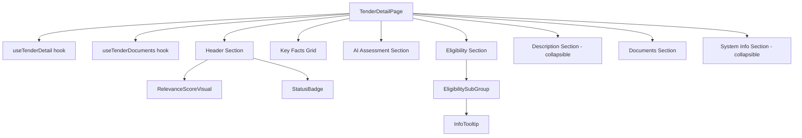

# Design Document — Tender Detail Page Redesign

## Overview

This design reorganizes the existing `TenderDetailPage.tsx` into a three-tier information hierarchy that matches how a Green Partners employee evaluates tenders:

1. **"Should I keep reading?"** — Header with title, org, relevance score, key facts, AI assessment
2. **"Can we bid?"** — Eligibility requirements, description, documents
3. **"System details"** — Scraper metadata, run links, analysis system fields (collapsed by default)

The page remains a single component at the same route (`/tenders/:sourceId/:tenderId`). Data fetching hooks (`useTenderDetail`, `useTenderDocuments`) are unchanged. The work is purely presentational: reordering sections, adding collapsible toggles, adding a tooltip for eligibility numeric data, and creating a prominent relevance score visual.

## Architecture

The redesign stays within the existing architecture. No new routes, hooks, or API calls are introduced.



### Key Architectural Decisions

| Decision | Choice | Rationale |
|----------|--------|-----------|
| Collapsible sections | Local `useState` toggle | No library needed; two sections only (Description, System Info) |
| Tooltip for eligibility data | shadcn/ui Tooltip (via `@base-ui/react`) | Already in dependencies; consistent with component library |
| Prominent relevance score | New `RelevanceScoreVisual` component | Existing `ScoreBadge` is too small (pill badge); header needs a larger visual |
| `Field` component | Keep inline in page file | Only used by this page; extracting adds indirection without reuse benefit |
| `formatBytes` | Keep inline in page file | Only used by this page for document sizes |
| EUR formatting for eligibility | Reuse `formatBudget` pattern via shared `eurFormatter` | Consistent currency formatting across the app |

## Components and Interfaces

### New Components

#### `RelevanceScoreVisual`
Location: `src/components/RelevanceScoreVisual.tsx`

A larger, more prominent score display for the header area. Renders the numeric score inside a colored circle/badge that is visually dominant.

```typescript
interface RelevanceScoreVisualProps {
  score: number | null
}
```

Color mapping (same as existing `ScoreBadge`):
- Green: scores 7–10
- Yellow: scores 4–6
- Red: scores 1–3
- Gray: null or 0

Reuses `getScoreBadgeColor` from `src/utils/formatting.ts` for color logic.

#### `EligibilitySubGroup`
Defined inline within `TenderDetailPage.tsx`. Renders a single eligibility sub-group (experts, references, or turnover).

```typescript
interface EligibilitySubGroupProps {
  title: string
  notes: string | null
  numericContent: React.ReactNode  // structured data rendered as tooltip content or inline fallback
}
```

Behavior:
- When `notes` is present: display notes as primary content, numeric data behind an info icon tooltip
- When `notes` is null: display numeric data inline as fallback

#### `InfoTooltip`
Location: `src/components/InfoTooltip.tsx`

A small info icon (ℹ️ from lucide-react `Info` icon) that reveals content on hover via shadcn/ui Tooltip.

```typescript
interface InfoTooltipProps {
  children: React.ReactNode  // tooltip content
}
```

Uses `@base-ui/react` Tooltip primitives (already a dependency) or shadcn/ui Tooltip component.

### Modified Components

#### `TenderDetailPage` (major restructure)
- Reorder sections per Requirement 8
- Add collapsible Description section with preview (4–6 lines)
- Add collapsible System Info section (collapsed by default)
- Consolidate eligibility requirements into single section
- Replace `ScoreBadge` in header with `RelevanceScoreVisual`
- Move AI context before summary
- Add `emailed_at` to System Info section

### Existing Components (unchanged)
- `ScoreBadge` — still used in other pages (tender list)
- `StatusBadge` — used as-is in header and system info
- `ErrorAlert` — used as-is for error states
- `LoadingSpinner` — used as-is for loading states

## Data Models

### Type Change: `TenderDetailResponse`

The `emailed_at` field already exists in `src/api/types.ts` as `emailed_at: string | null`. No type changes needed — the field is already defined.

### No New API Types

All data comes from existing `TenderDetailResponse` and `DocumentItem` types. No new API endpoints or response types are required.

### Local UI State

```typescript
// Inside TenderDetailPage component
const [descriptionExpanded, setDescriptionExpanded] = useState(false)
const [systemInfoExpanded, setSystemInfoExpanded] = useState(false)
```

### EUR Formatting

Eligibility monetary values (`value_eur`, `annual_eur`) will use the same `Intl.NumberFormat` pattern already used in the current page. Consider extracting the existing inline `eurFormatter` into `src/utils/formatting.ts` as a shared `formatEur(value: number): string` function to avoid duplication.

```typescript
// src/utils/formatting.ts (addition)
export function formatEur(value: number): string {
  return eurFormatter.format(value)  // eurFormatter already exists in this file
}
```


## Correctness Properties

*A property is a characteristic or behavior that should hold true across all valid executions of a system — essentially, a formal statement about what the system should do. Properties serve as the bridge between human-readable specifications and machine-verifiable correctness guarantees.*

### Property 1: Score color mapping

*For any* relevance score value (integer 0–10 or null), the `RelevanceScoreVisual` component should render the correct color: green for 7–10, yellow for 4–6, red for 1–3, and gray for null or 0.

**Validates: Requirements 1.3**

### Property 2: Conditional section omission for null data

*For any* tender data object, sections and sub-sections with null/missing data should be omitted from the rendered output: AI Assessment is omitted when both `analysis_context` and `analysis_summary` are null; each eligibility sub-group is omitted when its corresponding field is null; the entire Eligibility section is omitted when all three requirement fields are null; the Description section is omitted when `description_text` is null; the warnings banner is omitted when `warnings` is empty.

**Validates: Requirements 1.6, 3.4, 3.5, 3.6, 4.6, 4.7, 4.8, 4.9, 5.5**

### Property 3: Null field dash placeholder

*For any* tender field that is nullable and currently null, the rendered page should display a dash ("—") as a placeholder in both the Key Facts Grid and the System Info Section.

**Validates: Requirements 2.4, 7.5**

### Property 4: Eligibility notes-primary with numeric fallback

*For any* eligibility sub-group (experts, references, or turnover), when the `notes` field is present, the notes text should be the primary visible content; when `notes` is null, the structured numeric data should be displayed inline instead.

**Validates: Requirements 4.3, 4.5**

### Property 5: EUR currency formatting for eligibility values

*For any* monetary value in eligibility data (`value_eur`, `annual_eur`), the formatted output should match EUR currency format (using `Intl.NumberFormat` with `en-IE` locale and `EUR` currency).

**Validates: Requirements 4.10**

### Property 6: Description collapse/expand behavior

*For any* tender with a `description_text` longer than the preview threshold (4–6 lines), the initial render should show only the preview with a "Show full description" toggle; after activating the toggle, the full description text should be visible.

**Validates: Requirements 5.1, 5.2, 5.3**

### Property 7: System info expand reveals all metadata fields

*For any* tender, the System Info Section should be collapsed by default; after activating the expand toggle, all system metadata fields (scraper status, retry_count, last_attempt, last_error, documents_downloaded, documents_failed, skip_reason, run links, analysis_model, analyzed_at, emailed_at, source_id, tender_id) should be visible in the rendered output.

**Validates: Requirements 7.2, 7.3, 7.4**

## Error Handling

### Loading States
- Full-page `LoadingSpinner` while `useTenderDetail` is loading (existing behavior, unchanged)
- Inline `LoadingSpinner` inside Documents Section while `useTenderDocuments` is loading

### Error States
- **404 error**: "Tender not found" message with back link to `/tenders` (existing behavior, unchanged)
- **Other API errors**: `ErrorAlert` with error message and retry button (existing behavior, unchanged)
- **Documents API error**: `ErrorAlert` with retry button scoped to the Documents Section

### Edge Cases
- `emailed_at` may be null for tenders not yet returned by the API — display "—" in System Info
- All eligibility fields null — omit entire Eligibility Section
- Both AI assessment fields null — omit entire AI Assessment Section
- Description text null — omit Description Section
- Empty warnings array — omit warnings banner
- Empty documents list — show "No documents available" message

## Testing Strategy

### Approach: Playwright Visual Testing

Per the project's frontend-tester power, testing should use Playwright visual testing rather than unit tests for the page layout. However, the following pure-logic concerns are testable with Vitest + fast-check:

### Property-Based Tests (Vitest + fast-check)

Each correctness property should be implemented as a single property-based test with minimum 100 iterations.

| Property | Test Target | Library |
|----------|-------------|---------|
| Property 1: Score color mapping | `getScoreBadgeColor` utility | fast-check |
| Property 5: EUR currency formatting | `formatEur` utility (new) | fast-check |

These two properties test pure functions and are ideal for property-based testing with fast-check.

### Component Tests (Vitest + @testing-library/react)

Properties 2, 3, 4, 6, and 7 involve React component rendering and are better tested as component-level tests:

| Property | Test Approach |
|----------|---------------|
| Property 2: Conditional section omission | Render with various null field combinations, assert sections absent |
| Property 3: Null field dash placeholder | Render with null fields, assert "—" appears |
| Property 4: Eligibility notes/numeric fallback | Render with notes present/absent, assert correct content |
| Property 6: Description collapse/expand | Render long description, assert preview → click → full text |
| Property 7: System info expand | Render, assert collapsed → click → fields visible |

These can still use fast-check to generate random tender data objects, then render the component and assert the properties hold.

### Test Configuration

- Minimum 100 iterations per property-based test
- Each test tagged with: **Feature: tender-detail-redesign, Property {number}: {property_text}**
- Use `msw` to mock API responses for component-level tests
- Use `fast-check` `fc.record()` to generate random `TenderDetailResponse` objects

### Unit Tests (specific examples)

- Section ordering (Requirement 8.1) — verify DOM order of section headings
- "Show full description" / "Show less" label toggle (Requirement 5.4)
- Documents table columns present (Requirement 6.2)
- Documents empty state message (Requirement 6.3)
- Documents loading spinner (Requirement 6.4)
- Documents error with retry (Requirement 6.5)
- System info collapsed by default (Requirement 7.2)
