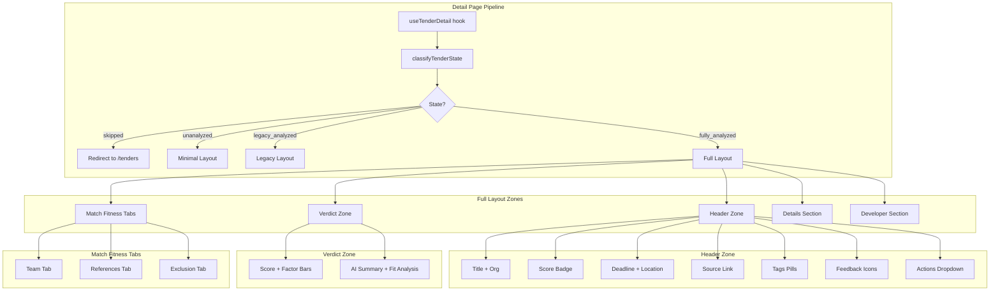

# Design Document: Tender Detail Reflow

## Overview

Redesign the tender detail page from a flat 12-section vertical layout into a verdict-first progressive disclosure page. The page detects the tender's lifecycle state (skipped, unanalyzed, legacy_analyzed, fully_analyzed) and adapts its rendering accordingly. Match fitness dimensions consolidate into a tabbed interface, action buttons move to a dropdown, AI summaries replace raw descriptions as primary content, and developer tooling collapses out of sight.

The design introduces a pure state-classification function at the top of the rendering pipeline, enabling all downstream components to branch on a single enum rather than re-checking nullable fields.

## Architecture



### Rendering Pipeline

1. **Data fetch** — `useTenderDetail` returns the full `TenderDetailResponse`
2. **State classification** — Pure function `classifyTenderState(tender)` returns one of four states
3. **Route guard** — If state is `skipped`, redirect immediately (no render)
4. **Zone composition** — Page composes zones based on state, passing tender data down

### Key Architectural Decisions

- **State classification is a pure function** — no side effects, easily testable, single source of truth for all conditional rendering
- **Zones are independent components** — each zone receives tender data and renders autonomously; no cross-zone state
- **Tabs use local state only** — active tab stored in component state, not URL or localStorage
- **Actions use existing mutation hooks** — dropdown triggers the same `apiPost` calls as current buttons, wrapped in `useMutation`

## Components and Interfaces

### New Components

| Component | Location | Purpose |
|-----------|----------|---------|
| `classifyTenderState` | `src/utils/tender-state.ts` | Pure function: `TenderDetailResponse → TenderState` |
| `getScoreBadgeColor` | `src/utils/tender-state.ts` | Pure function: `number \| null → 'green' \| 'yellow' \| 'red' \| 'gray'` |
| `getFactorBarColor` | `src/utils/tender-state.ts` | Pure function: `number → 'green' \| 'yellow' \| 'red'` |
| `humanizeTenderType` | `src/utils/format.ts` | Pure function: `string \| null → string \| null` |
| `HeaderZone` | `src/components/tender-detail/header-zone.tsx` | Replaces `HeaderSection` + `FeedbackButtons` |
| `VerdictZone` | `src/components/tender-detail/verdict-zone.tsx` | New: score + factor bars + AI summary |
| `MatchFitnessTabs` | `src/components/tender-detail/match-fitness-tabs.tsx` | Replaces 5 separate sections |
| `TeamTab` | `src/components/tender-detail/tabs/team-tab.tsx` | Merged team requirements + match |
| `ReferencesTab` | `src/components/tender-detail/tabs/references-tab.tsx` | Merged reference requirements + match |
| `ExclusionTab` | `src/components/tender-detail/tabs/exclusion-tab.tsx` | Merged exclusion criteria + result |
| `DetailsSection` | `src/components/tender-detail/details-section.tsx` | Replaces `KeyFactsSection` + `DescriptionSection` |
| `DeveloperSection` | `src/components/tender-detail/developer-section.tsx` | Replaces `SystemInfoSection` + `AuditTrailSection` |
| `ActionsDropdown` | `src/components/tender-detail/actions-dropdown.tsx` | New: dropdown menu for power-user mutations |
| `FactorBar` | `src/components/tender-detail/factor-bar.tsx` | New: colored horizontal bar for a score dimension |
| `ScoreBadge` | `src/components/tender-detail/score-badge.tsx` | New: color-coded score display |

### Removed Components (after migration)

| Component | Reason |
|-----------|--------|
| `header-section.tsx` | Replaced by `HeaderZone` |
| `ai-assessment-section.tsx` | Absorbed into `VerdictZone` |
| `feedback-buttons.tsx` | Absorbed into `HeaderZone` |
| `key-facts-section.tsx` | Absorbed into `DetailsSection` |
| `score-breakdown-section.tsx` | Replaced by `VerdictZone` factor bars |
| `team-requirements-section.tsx` | Merged into `TeamTab` |
| `team-match-section.tsx` | Merged into `TeamTab` |
| `reference-requirements-section.tsx` | Merged into `ReferencesTab` |
| `reference-match-section.tsx` | Merged into `ReferencesTab` |
| `exclusion-criteria-section.tsx` | Merged into `ExclusionTab` |
| `exclusion-banner.tsx` | Absorbed into `VerdictZone` exclusion factor bar |
| `eligibility-section.tsx` | Absorbed into `MatchFitnessTabs` legacy mode |
| `system-info-section.tsx` | Merged into `DeveloperSection` |
| `audit-trail-section.tsx` | Merged into `DeveloperSection` |

### New Hook

| Hook | Purpose |
|------|---------|
| `useTenderActions` | Wraps 5 mutation calls (extract-team, team-match, extract-references, reference-match, check-exclusion) with independent loading/error states per action |

### Component Props Interfaces

```typescript
// src/utils/tender-state.ts
export type TenderState = 'skipped' | 'unanalyzed' | 'legacy_analyzed' | 'fully_analyzed'

export function classifyTenderState(tender: TenderDetailResponse): TenderState

export function getScoreBadgeColor(score: number | null): 'green' | 'yellow' | 'red' | 'gray'

export function getFactorBarColor(score: number): 'green' | 'yellow' | 'red'

// src/utils/format.ts
export function humanizeTenderType(tenderType: string | null): string | null
```

```typescript
// HeaderZone props
interface HeaderZoneProps {
  tender: TenderDetailResponse
  sourceId: string
  tenderId: string
}

// VerdictZone props
interface VerdictZoneProps {
  tender: TenderDetailResponse
}

// MatchFitnessTabs props
interface MatchFitnessTabsProps {
  tender: TenderDetailResponse
  state: 'fully_analyzed' | 'legacy_analyzed'
  sourceId: string
  tenderId: string
}

// DetailsSection props
interface DetailsSectionProps {
  tender: TenderDetailResponse
  state: TenderState
  sourceId: string
  tenderId: string
}

// DeveloperSection props
interface DeveloperSectionProps {
  tender: TenderDetailResponse
  sourceId: string
  tenderId: string
}

// ActionsDropdown props
interface ActionsDropdownProps {
  sourceId: string
  tenderId: string
}
```

## Data Models

### TenderState Enum

```typescript
export type TenderState = 'skipped' | 'unanalyzed' | 'legacy_analyzed' | 'fully_analyzed'
```

### State Classification Logic

```typescript
export function classifyTenderState(tender: TenderDetailResponse): TenderState {
  // Precedence order: skipped > fully_analyzed > legacy_analyzed > unanalyzed
  if (tender.skip_reason != null) return 'skipped'
  if (tender.team_requirements != null || tender.reference_requirements != null || tender.exclusion_result != null) return 'fully_analyzed'
  if (tender.experts_required != null || tender.references_required != null || tender.turnover_required != null) return 'legacy_analyzed'
  return 'unanalyzed'
}
```

### Score Color Mapping

```typescript
export function getScoreBadgeColor(score: number | null): 'green' | 'yellow' | 'red' | 'gray' {
  if (score == null || score === 0) return 'gray'
  if (score >= 7.0) return 'green'
  if (score >= 4.0) return 'yellow'
  return 'red'
}

export function getFactorBarColor(score: number): 'green' | 'yellow' | 'red' {
  if (score >= 0.7) return 'green'
  if (score >= 0.4) return 'yellow'
  return 'red'
}
```

### Tender Type Humanization

```typescript
export function humanizeTenderType(tenderType: string | null): string | null {
  if (tenderType == null) return null
  return tenderType.split('_').map(word => word.charAt(0).toUpperCase() + word.slice(1)).join(' ')
}
```

### Actions Mutation State

```typescript
interface ActionState {
  isLoading: boolean
  error: string | null
}

interface TenderActionsState {
  extractTeam: ActionState
  runTeamMatch: ActionState
  extractReferences: ActionState
  runReferenceMatch: ActionState
  checkExclusion: ActionState
}
```

### Section Visibility Matrix

| State | Warnings | Header | Verdict | Match Fitness | Details | Documents | Developer |
|-------|----------|--------|---------|---------------|---------|-----------|-----------|
| skipped | — | — | — | — | — | — | — |
| unanalyzed | yes | yes | no | no | yes (expanded) | yes | no |
| legacy_analyzed | yes | yes | yes | yes (legacy) | yes | yes | yes |
| fully_analyzed | yes | yes | yes | yes (full) | yes | yes | yes |

## Correctness Properties

*A property is a characteristic or behavior that should hold true across all valid executions of a system — essentially, a formal statement about what the system should do. Properties serve as the bridge between human-readable specifications and machine-verifiable correctness guarantees.*

### Property 1: State classification is total and deterministic

*For any* `TenderDetailResponse` object with arbitrary combinations of nullable fields (`skip_reason`, `team_requirements`, `reference_requirements`, `exclusion_result`, `experts_required`, `references_required`, `turnover_required`), `classifyTenderState` SHALL return exactly one value from the set `{skipped, unanalyzed, legacy_analyzed, fully_analyzed}`.

**Validates: Requirements 1.1, 1.6**

### Property 2: skip_reason dominates all other classification fields

*For any* `TenderDetailResponse` where `skip_reason` is non-null, `classifyTenderState` SHALL return `skipped` regardless of the values of `team_requirements`, `reference_requirements`, `exclusion_result`, `experts_required`, `references_required`, and `turnover_required`.

**Validates: Requirements 1.2**

### Property 3: Score badge color mapping respects range boundaries

*For any* numeric score value, `getScoreBadgeColor` SHALL return `green` when score ≥ 7.0, `yellow` when 4.0 ≤ score < 7.0, `red` when 0 < score < 4.0, and `gray` when score is null or zero. No score value SHALL produce a color outside these four values.

**Validates: Requirements 3.3, 4.2**

### Property 4: Factor bar color mapping respects range boundaries

*For any* numeric score in the range [0, 1], `getFactorBarColor` SHALL return `green` when score ≥ 0.7, `yellow` when 0.4 ≤ score < 0.7, and `red` when score < 0.4.

**Validates: Requirements 4.4**

### Property 5: Tender type humanization produces no underscores and title-cases each word

*For any* non-null string input, `humanizeTenderType` SHALL return a string containing no underscore characters, where each space-separated word starts with an uppercase letter.

**Validates: Requirements 6.5, 10.4**

## Error Handling

### API Errors

| Scenario | Handling |
|----------|----------|
| Tender detail 404 | Show "Tender not found" with back link (existing behavior) |
| Tender detail network error | Show `ErrorAlert` with retry button (existing behavior) |
| Documents fetch failure | Show error message with retry within Documents area |
| Audit trail fetch failure | Show error within Developer section, don't affect other fields |
| Action mutation failure | Show inline error on the specific dropdown item, dismissible |

### Data Edge Cases

| Scenario | Handling |
|----------|----------|
| All AI fields null (unanalyzed) | Verdict Zone not rendered; description shown expanded |
| Partial factor data (e.g. team score but no reference score) | Render only available factor bars |
| Budget = 0 | Display "Not specified" |
| description_text null | Hide description area entirely |
| Empty warnings array | Don't render warnings banner |
| Empty analysis_tags | Don't render tags area in header |

### Redirect Edge Cases

| Scenario | Handling |
|----------|----------|
| User navigates directly to skipped tender URL | Redirect to `/tenders` before render |
| Tender becomes skipped after page load (stale data) | Next refetch triggers redirect |

## Testing Strategy

### Property-Based Tests (fast-check)

Property-based testing applies to the pure utility functions that drive rendering decisions. Each test runs minimum 100 iterations.

| Property | Function Under Test | Library |
|----------|-------------------|---------|
| Property 1: Total and deterministic classification | `classifyTenderState` | fast-check |
| Property 2: skip_reason dominance | `classifyTenderState` | fast-check |
| Property 3: Score badge color boundaries | `getScoreBadgeColor` | fast-check |
| Property 4: Factor bar color boundaries | `getFactorBarColor` | fast-check |
| Property 5: Humanization invariants | `humanizeTenderType` | fast-check |

Configuration:
- Library: `fast-check` (already in project devDependencies)
- Minimum iterations: 100 per property
- Tag format: `Feature: tender-detail-reflow, Property N: <property text>`
- Each correctness property maps to exactly one property-based test

### Unit Tests (vitest + @testing-library/react)

Example-based tests for component rendering per state:

- **State-aware rendering**: One test per state verifying correct section presence/absence
- **Header Zone**: Title truncation, org fallback, score badge, deadline format, tags, feedback active state
- **Verdict Zone**: Content priority cascade (context → summary → reasoning → empty state)
- **Match Fitness Tabs**: Tab switching, merged data display, legacy fallback, empty states
- **Details Section**: Description collapse/expand toggle, budget formatting, document states
- **Actions Dropdown**: Menu item order, mutation trigger, loading spinner, error display, independent execution
- **Developer Section**: Collapsed default, expand/collapse toggle, audit trail ordering, error isolation
- **Redirect**: Skipped tender triggers navigation to `/tenders`

### Integration Tests

- Full page render with mocked API responses for each tender state
- Actions dropdown → mutation → query invalidation → re-render cycle
- Tab switching preserves content across tabs
