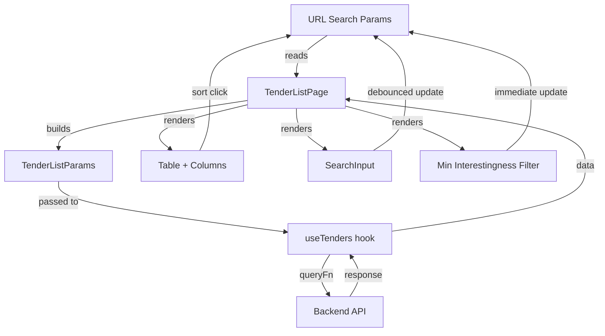
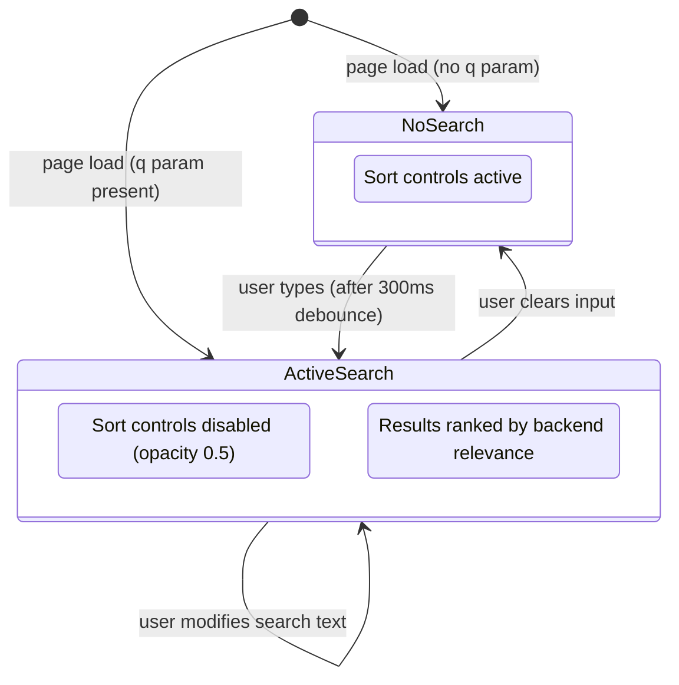

# Design Document: Tender List Enhancements

## Overview

This feature adds full-text search, two new score columns (interestingness and unified), and a minimum interestingness filter to the existing tender list page. All changes are confined to `src/api/types.ts`, `src/pages/TenderListPage.tsx`, `src/utils/formatting.ts`, and potentially a new `SearchInput` component.

The design leverages existing patterns: URL-driven state via `useSearchParams`, the existing `ScoreBadge` component (extended for float display), the `updateFilters` helper for param management, and the existing sort infrastructure.

## Architecture

The feature follows the existing page-level architecture — no new layers, services, or state management patterns introduced.



Key architectural decisions:

1. **URL as single source of truth** — All new params (`q`, `min_interestingness`) follow the existing pattern of reading from and writing to `useSearchParams`. No local state duplication except the debounce buffer inside SearchInput.
2. **Search disables sort at the UI and API level** — When `q` is non-empty, sort click handlers are no-ops, sort params are omitted from the API request, but existing sort URL params are preserved for when search is cleared.
3. **ScoreBadge reuse** — The existing `ScoreBadge` handles integer display with color thresholds. A new `getUnifiedScoreBadgeColor` utility handles float formatting (1 decimal) with the same color scale.

## Components and Interfaces

### New: SearchInput Component

A self-contained debounced text input. Extracted as a component because it manages internal state (the debounce buffer) that shouldn't live in the page.

```typescript
// src/components/SearchInput.tsx
interface SearchInputProps {
  value: string           // Current q param from URL
  onChange: (value: string) => void  // Called after debounce with new value
  debounceMs?: number     // Default 300
}
```

Internally uses `useState` for immediate input display + `useEffect` with `setTimeout` for debounce. On mount, initializes from `value` prop. On `value` prop change (e.g. browser back), syncs internal state.

### Modified: TenderListPage

Changes to existing page:

| Area | Change |
|------|--------|
| SortField type | Widen to include `'interestingness_score' \| 'unified_score'` |
| SORT_FIELDS array | Add `'interestingness_score'`, `'unified_score'` |
| queryParams builder | Add `q` and `min_interestingness` from URL; omit `sort_by`/`sort_direction` when `q` is non-empty |
| Sort controls | Conditional disabled state (opacity-50, cursor-default, no click handler) when `q` is non-empty |
| Table columns | Add Interestingness and Unified columns after Relevance Score |
| Filter bar | Add SearchInput above table, Min Interestingness dropdown in filter bar |
| Empty state | Differentiate search-specific empty state from generic |

### Modified: ScoreBadge (usage, not component)

The existing `ScoreBadge` component is reused as-is for the Interestingness column (integer 1–10, same color thresholds as relevance). For the Unified column, a new inline rendering using the same badge shell but with `getUnifiedScoreBadgeColor` for float formatting.

### Modified: src/utils/formatting.ts

New function:

```typescript
export function getUnifiedScoreBadgeColor(score: number | null): ScoreBadgeResult {
  if (score === null) return { color: 'gray', label: '—' }
  if (score === 0) return { color: 'gray', label: 'Filtered' }
  if (score >= 7.0) return { color: 'green', label: score.toFixed(1) }
  if (score >= 4.0) return { color: 'yellow', label: score.toFixed(1) }
  return { color: 'red', label: score.toFixed(1) }
}
```

Also update `getScoreBadgeColor` to return `'—'` for null instead of `'N/A'` for the interestingness column (or add a separate variant). Decision: add a new `getInterestingnessScoreBadgeColor` that returns `'—'` for null but otherwise uses the same thresholds. The existing `getScoreBadgeColor` stays unchanged to avoid touching the relevance column.

```typescript
export function getInterestingnessScoreBadgeColor(score: number | null): ScoreBadgeResult {
  if (score === null) return { color: 'gray', label: '—' }
  if (score === 0) return { color: 'gray', label: 'Filtered' }
  if (score >= 7) return { color: 'green', label: String(score) }
  if (score >= 4) return { color: 'yellow', label: String(score) }
  return { color: 'red', label: String(score) }
}
```

### Modified: src/api/types.ts

```typescript
// TenderListItem — add:
interestingness_score: number | null
unified_score: number | null

// TenderListParams — add:
q?: string
min_interestingness?: string
```

## Data Models

### URL Parameters (additions)

| Param | Type | Default | Notes |
|-------|------|---------|-------|
| `q` | string | absent | Full-text search query, debounced 300ms |
| `min_interestingness` | string (integer 1–10) | absent | Minimum interestingness threshold |

### API Request Parameters (additions to existing)

| Param | Type | Sent when |
|-------|------|-----------|
| `q` | string | Non-empty search query |
| `min_interestingness` | integer (1–10) | Filter is set |
| `sort_by` | string | q is empty AND sort is not default |
| `sort_direction` | string | q is empty AND sort is not default |

### TenderListItem (additions)

| Field | Type | Source |
|-------|------|--------|
| `interestingness_score` | `number \| null` | Backend scoring pipeline |
| `unified_score` | `number \| null` | Backend combined score |

### State Flow



## Correctness Properties

*A property is a characteristic or behavior that should hold true across all valid executions of a system — essentially, a formal statement about what the system should do. Properties serve as the bridge between human-readable specifications and machine-verifiable correctness guarantees.*

### Property 1: Debounce delays URL update

*For any* sequence of keystrokes in the SearchInput, the URL `q` parameter SHALL only update after 300ms of inactivity — intermediate keystrokes within the debounce window SHALL NOT produce URL updates.

**Validates: Requirements 1.2**

### Property 2: Search disables sort params in API request

*For any* non-empty `q` URL parameter value, the built `TenderListParams` object SHALL NOT contain `sort_by` or `sort_direction` fields, regardless of what sort-related URL parameters are present.

**Validates: Requirements 1.4, 7.5**

### Property 3: Sort controls inactive during search

*For any* non-empty `q` URL parameter value, all sort control elements SHALL have opacity 0.5 and cursor default, and click events on sort controls SHALL not modify URL parameters.

**Validates: Requirements 7.1, 7.2**

### Property 4: Sort params preserved during search

*For any* transition from empty `q` to non-empty `q` and back to empty `q`, the `sort_by` and `sort_direction` URL parameters SHALL be unchanged (not cleared) and re-applied to the next data fetch after search is cleared.

**Validates: Requirements 7.3, 7.4**

### Property 5: Interestingness score color mapping

*For any* interestingness score value, the badge color SHALL be: gray for null (label "—"), gray for 0 (label "Filtered"), green for 7–10, yellow for 4–6, red for 1–3.

**Validates: Requirements 3.2, 3.3**

### Property 6: Unified score formatting and color mapping

*For any* unified score value, the badge SHALL display: "—" in gray for null, "Filtered" in gray for 0.0, the value formatted to exactly 1 decimal place with green for ≥7.0, yellow for ≥4.0, red for <4.0.

**Validates: Requirements 4.2, 4.3**

### Property 7: Min interestingness filter round-trip

*For any* valid integer between 1 and 10 selected in the Min_Interestingness_Filter, the URL `min_interestingness` parameter SHALL equal that integer, and the filter dropdown SHALL display the corresponding "N+" option. Selecting "All" SHALL remove the parameter.

**Validates: Requirements 5.2, 5.3, 5.4, 5.5**

### Property 8: Invalid min_interestingness param normalization

*For any* `min_interestingness` URL parameter value that is NOT a valid integer between 1 and 10, the filter SHALL display "All" and the invalid parameter SHALL be removed from the URL.

**Validates: Requirements 5.6**

### Property 9: Search-specific empty state differentiation

*For any* API response with zero items, the empty state message SHALL be "No tenders match your search" with a "Clear search" button when `q` is non-empty, and "No tenders found" (existing generic) when `q` is empty.

**Validates: Requirements 2.1, 2.2, 2.4**

### Property 10: Clear search preserves other filters

*For any* combination of active filters (status, source_id, date range, analyzed, min_interestingness) plus a non-empty `q`, clicking "Clear search" SHALL remove only `q` from the URL and preserve all other filter parameters.

**Validates: Requirements 2.3**

## Error Handling

| Scenario | Handling |
|----------|----------|
| API returns error during search | Existing `ErrorAlert` with retry — no search-specific error handling needed |
| `q` param > 200 chars | Truncate at input level via `maxLength` attribute on the input element |
| `min_interestingness` param invalid on page load | Silently fall back to "All" and remove invalid param from URL |
| Null scores in API response | Display "—" placeholder — already handled by badge color functions |
| Network timeout during debounced search | TanStack Query retry logic handles this transparently |

## Testing Strategy

### Unit Tests (Vitest + @testing-library/react)

- **SearchInput debounce**: Verify `onChange` is only called after debounce period, not on every keystroke
- **queryParams builder**: Verify sort params excluded when `q` is present
- **Sort control disabled state**: Verify opacity/cursor classes applied when `q` is non-empty
- **Empty state differentiation**: Verify correct message based on `q` presence
- **Min interestingness validation**: Verify invalid param falls back to "All"
- **Score formatting functions**: Verify color and label output for boundary values

### Property-Based Tests (Vitest + fast-check)

Each correctness property above maps to a property-based test:

- **Library**: fast-check (already in project dependencies)
- **Minimum iterations**: 100 per property
- **Tag format**: `Feature: tender-list-enhancements, Property {N}: {title}`

Property tests focus on:
- `getInterestingnessScoreBadgeColor` and `getUnifiedScoreBadgeColor` — test across full numeric range
- `queryParams` builder logic — generate arbitrary param combinations, verify sort exclusion when q present
- Debounce timing — generate keystroke sequences, verify single output after debounce
- URL param preservation — generate sort+search transitions, verify no sort param loss

### Integration Verification

- Manual check against local API: search "biodiversity", sort by interestingness, filter min_interestingness=4
- Verify null score rendering with current data (most tenders have null interestingness/unified)
- Verify sort disabled state visually when search is active
